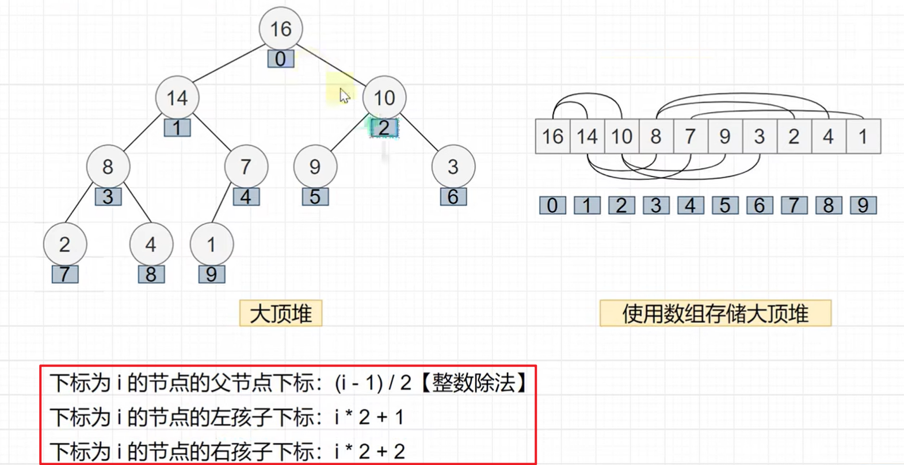

# 八大排序算法

### 1.冒泡排序

```c
//1.冒泡排序 ,人的悲欢并不相通 
void bubblesort(int *arr,int len){
	int i,j,temp;
	for(i=0;i<len;i++){
		for(j=0;j<len-i-1;j++){
			if(arr[j]>arr[j+1]){
				temp = arr[j];
				arr[j] = arr[j+1];
				arr[j+1] = temp; 
			}
		}
	}
}
```

### 2.选择排序

视频链接：https://www.bilibili.com/video/BV1mmrUY8Evu/?spm_id_from=333.337.search-card.all.click&vd_source=4d8bdaa129d34a4905c8db625c08e44d

```c
void SelectionSort(int* arr,int len) {
	int i,j,minR,temp;
	for(i=0;i<len-1;i++){
		minR = i;//记录最小值的下标 
		for(j=i+1;j<len;j++){
			if(arr[j]<arr[minR]){
				minR = j;
			}
		}
		temp = arr[minR];
		arr[minR] = arr[i];
		arr[i] = temp;
	}
}
```

### 3.插入排序

视频链接:https://www.bilibili.com/video/BV19J4m1875v/?spm_id_from=333.337.search-card.all.click&vd_source=4d8bdaa129d34a4905c8db625c08e44d 

```c
void InsertionSort(int arr[], int len) {//8 4 3
     int i,j,key;
     for(i = 1;i<len;i++){
     	key = arr[i];//记录前一个数,(arr[1])4 
     	j = i-1;//记录第一个数,arr[0](8) 
     	while(j>=0&&arr[j]>key){//8>4
     		arr[j+1] = arr[j];//arr[1] = arr[0] = 8
     		j--;//j =0-1=-1
		 }
		arr[j+1] = key;//arr[-1+1=0]=4 
	 }
}
```

### 4.希尔排序

```c
void ShellSort(int *arr, int len) {
     int i,j,key,gap;//"7" 6 5 4 "3" 2 1 0
     for(gap=len/2;gap>0;gap/=2){//gap = 8/2 = 4, gap = (4,2,1)
     	for(i=gap;i<len;i++){
     		key=arr[i];//key=arr[4]=3(3)
     		j=i-gap;//j=i-gap=4-4=0(7)
     		while(j>=0&&arr[j]>key){//arr[0] = 7 > key=3 (7>3)
     			arr[j+gap]=arr[j];//arr[4]=arr[0]=7
     			j-=gap;//j=0-4=-4
			 }
			 arr[j+gap]=key;//arr[-4+4=0]=3,  arr[0]=3  arr[4]=7
		 }
	 }
}
```

 ```c
 void ShellSort(int arr[], int len) {
     int i, j, key, gap;
 
     // 初始gap为数组的一半，然后逐步减小，直到gap=1
     for (gap = len / 2; gap > 0; gap /= 2) {
         // 对当前gap值的子序列进行插入排序
         for (i = gap; i < len; i++) {
             key = arr[i];  // 记录当前元素
             j = i - gap;  // j从i-gab开始
 
             // 将大于key的元素向后移动
             while (j >= 0 && arr[j] > key) {
                 arr[j + gap] = arr[j];  // 向后移动
                 j -= gap;  // j减去gap
             }
 
             // 将key插入到正确的位置
             arr[j + gap] = key;
         }
     }
 }
 ```

### 5.快速排序

视频链接:https://www.bilibili.com/video/BV1vP411g7J3/?spm_id_from=333.337.search-card.all.click&vd_source=4d8bdaa129d34a4905c8db625c08e44d

```c
void QuickSort(int *arr,int left,int right){
	int pivot;
	if(left < right) {
     	pivot = Partition(arr,left,right);
		QuickSort(arr,left,pivot-1);
		QuickSort(arr,pivot+1,right);  
	}
}
 
int Partition(int *arr, int left, int right) {
     int pivot;
     pivot = arr[left];
     while(left<right){
     	while(left<right&&pivot<=arr[right]) right--;
     	arr[left]=arr[right];
     	while(left<right&&pivot>=arr[left]) left++;
     	arr[right]=arr[left];
	 }
	 arr[right]=pivot;
	 return right;
}
```

### 6.堆排序

堆排序，父节点与左右孩子的关系

视频链接:https://www.bilibili.com/video/BV1fp4y1D7cj/?spm_id_from=333.337.search-card.all.click&vd_source=4d8bdaa129d34a4905c8db625c08e44d 



```c
//维护堆的性质 
void  heapify(int *arr,int len,int i){
	int largest = i;//最大的节点下标 
	int lson = i*2+1;//左孩子 
	int rson = i*2+2;//右孩子
	if(lson<len&&arr[largest]<arr[lson])//如果左孩子比父节点大，将最大值下标赋值给父节点下标 
	    largest=lson;
	if(rson<len&&arr[largest]<arr[rson])//如果右孩子比父节点大 
	    largest=rson;
	if(largest != i){
		swap(&arr[largest],&arr[i]);//交换最大节点与父节点
		heapify(arr,len,largest);//递归调用 
	}			
}

void swap(int *a,int *b) {
	int temp;
	temp=*a;
	*a=*b;
	*b=temp;
}
//堆排序代码
void HeapSort(int *arr, int n) {
    int i;
    //建立堆
	for(i=n/2-1;i>=0;i--){//i = n/2 - 1表示找到父节点 
		heapify(arr,n,i);
	}
	//排序
	for(i=n-1;i>0;i--){
		swap(&arr[i],&arr[0]);
		heapify(arr,i,0);
	}
}
```

### 7.归并排序

视频链接:[排序算法：归并排序【图解+代码】_哔哩哔哩_bilibili](https://www.bilibili.com/video/BV1Pt4y197VZ?spm_id_from=333.788.videopod.sections&vd_source=4d8bdaa129d34a4905c8db625c08e44d)

```c
int MergeSort(int *arr, int n) {
     //分配一个辅助数组
	 int *tempArr = (int *)malloc(n*sizeof(int));
	 if(tempArr){
	 	msort(arr,tempArr,0,n-1);
	 	free(tempArr);
	 } else {
	 	printf("error:failed to allocate memory!");
	 } 
}

void merge(int *arr,int *tempArr,int left,int mid,int right){
	//标记左半区第一个未排序的元素
	int l_pos = left;
	//标记右半区第一个未排序的元素 
	int r_pos = mid+1;
	//临时数组元素的下标
	int pos = left;
	
	//左半区有元素，右半区也有元素
	while(l_pos <= mid && r_pos <= right){
		if(arr[l_pos] < arr[r_pos]){//左半区第一个元素更小 
			tempArr[pos++] = arr[l_pos++];
		} else {                    //右半区的剩余元素更小 
			tempArr[pos++] = arr[r_pos++];
		}
	} 
	//合并左半区剩余元素 
	while(l_pos <= mid){
		tempArr[pos++] = arr[l_pos++];
	} 
	//合并右半区剩余的元素
	while(r_pos <= right){
		tempArr[pos++] = arr[r_pos++];
	}
	//把临时数组中合并后的元素复制回原来的数组
	while(left <= right){
		arr[left] = tempArr[left];
		left++;
	} 
} 

void msort(int *arr,int *tempArr,int left,int right) {
	//如果只有一个元素就不需要划分了
	if(left<right){
		//分 
		int mid = (left+right)/2;//找中间点 
	    msort(arr,tempArr,left,mid);//递归左半区
		msort(arr,tempArr,mid+1,right);//递归右半区
		//合
		//合并已经排序的部分 
		merge(arr,tempArr,left,mid,right);	
	} 
}
```

### 8.基数排序

```c
```


