## 指针和引用

一个学习网站：[前 Free 门课程 - 在线学习 Free](https://www.coursera.org/courses?query=free)

一个超级论坛：[最新问题 - Stack Overflow](https://stackoverflow.com/questions)

#### 1.取地址和指针


#### 2.*的意义

（1）

```c
int *p = &a;//表示将a的地址赋值给int类型的指针p
    *p = 100;//将*p指针对应的值赋值为100
```

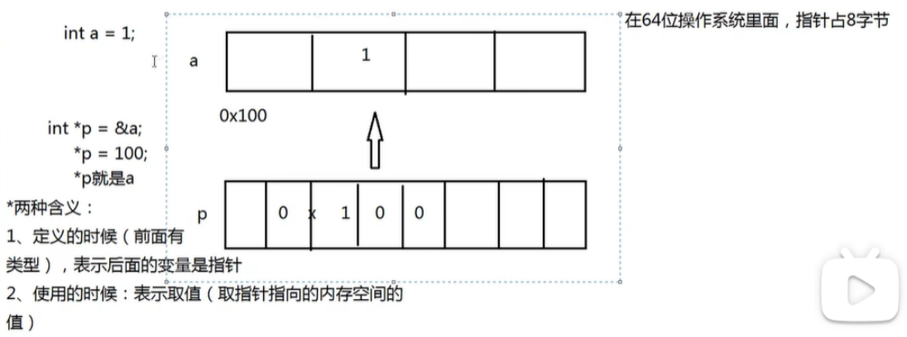

#### 3.不同类型指针的长度与不同类型的长度对比

```c
#include <stdio.h>
 
int main()
{
    int *int_ptr;
    char *char_ptr;
    float *float_ptr;
    double *double_ptr;
 
    printf("int 指针的长度: %zu 字节\n", sizeof(int_ptr));
    printf("char 指针的长度: %zu 字节\n", sizeof(char_ptr));
    printf("float 指针的长度: %zu 字节\n", sizeof(float_ptr));
    printf("double 指针的长度: %zu 字节\n", sizeof(double_ptr));
 
    return 0;
}
```

输出结果

**32位系统**

```
int 指针的长度: 4 字节
char 指针的长度: 4 字节
float 指针的长度: 4 字节
double 指针的长度: 4 字节
```

64位系统

```
int 指针的长度: 8 字节
char 指针的长度: 8 字节
float 指针的长度: 8 字节
double 指针的长度: 8 字节
```

- **指针的长度与系统架构有关**：***\*在 32 位系统中，所有指针的长度都是 4 个字节；在 64 位系统中，所有指针的长度都是 8 个字节\****。
- **指针的长度与指向的数据类型无关：无论指针指向 int、char、float 还是 double，指针本身的长度是固定的，由系统的位数决定。**

**C语言的不同类型长度**

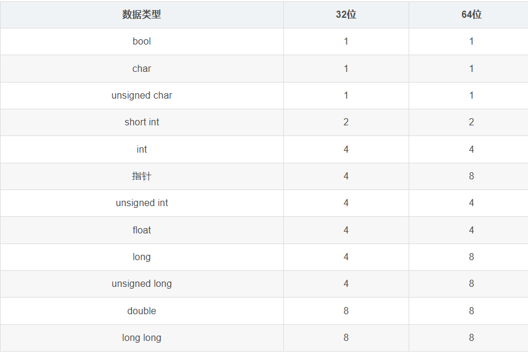

C中不同数据类型所占的字节大小，在不同的操作系统和编译器下，是不同的，一般主要说[gcc](https://so.csdn.net/so/search?q=gcc&spm=1001.2101.3001.7020)下，32位或64位系统的，红色部分是32和64位系统不同的。

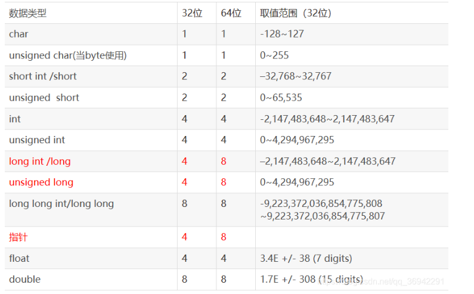

归纳总结：除了指针和long随操作系统变化之外，其他均不变（32位与64位操作系统比较）。

> 注意：
> 1.Linux下long是8字节，Windows下是4字节。
> 2.string的大小：32位和64位下string差4byte，其实就是一个指针的差别。string内部并不保存字符串本身，而是保存了一个指向字符串开头的指针。

#### 4.不同指针的“步长”区别，赋值时的指针应用

```c
#include <stdio.h>

int main(){
    int num = 1;
    int *p = &num; *p = 100; //等价于 int num = 100; 
    printf("num = %d" , num);
    
    char ch = 'a';
    //int *q = &ch ,会导致类型不兼容
    char *q = &ch;
    *q = 'x';
    
    printf("%c\n",ch); //输出 x
    printf("%p\n",p);  //输出 0x7fffd75878b4
    printf("%p\n",q);  //输出 0x7fffd75878b3
    
    printf("%p\n",p+1); //输出0x7fffd75878b8，p指向的是整数，整数占4个字节，所以p+1加4个字节
    printf("%p\n",q+1); //输出0x7fffd75878b4，q指向的是字符，字符占1个字节，所以q+1加1个字节
    return 0;
}
```

#### 5.指针在函数参数的使用

典型错误，由于自定义函数最后栈空间被释放，因此a,b在主函数没有交换

```c
#include <stdio.h>
#include <stdlib.h>

void swap(int x,int y){
	int t = x;
	x = y;
	y = t;
}

int main() {
	int a = 1; int b = 2;
	swap(a,b);
	printf("a = %d, b = %d\n",a,b); 
	
	return 0;
}
```

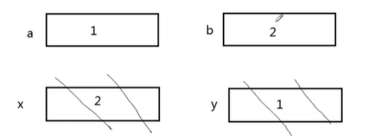

正确解法：如果要交换实参的值， 必须要传地址 

```c
#include <stdio.h>
#include <stdlib.h>

void swap(int *x,int *y){
	int t = *x;
	*x = *y;
	*y = t;
}

int main() {
	int a = 1; int b = 2;
	swap(&a,&b);//如果要交换实参的值， 必须要传地址 
	printf("a = %d, b = %d\n",a,b); 
	
	return 0;
}
```

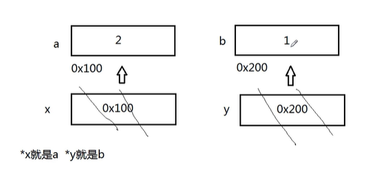

#### 6.`*pa++与 (*pa)++与 ++*pa`区别

```c
int main() {
	int a,*pa = &a,*pb; 
	//int a; 
	//int *pa = &a;       pa指向a的地址 
	//int *pb;            声明pb指针 

	pb = pa;
    //    pa = pb             pb也指向a的地址 
    
    int x = 3,y = 0,*pa = &x;
	y = *pa+5;    //y = 8 
	y = ++*pa;    //先执行++,然后将值赋值给y 
	printf("y = %d,*pa = %d\n",y,*pa);//y = 4,*pa = 4 
    //*pa++与(*pa)++的区别 	
	//y = *pa++;  //执行pa++，会形成野指针，即为指向y的地址的下一位，显然这是非法区 
	y = (*pa)++;  //先执行赋值，然后再执行++ 
	printf("y = %d,*pa = %d\n",y,*pa);//y = 4,*pa = 5
	 
	return 0;
}
```

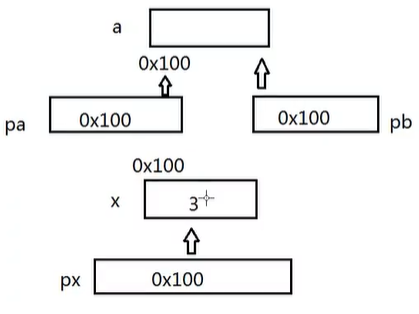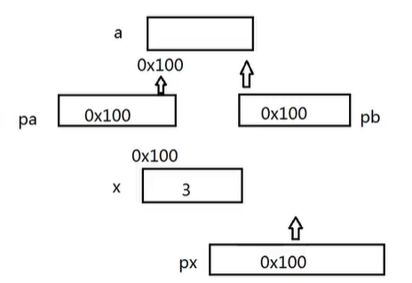

完成`strcpy`的函数指针应用（*pa++应用）

```c
#include <stdio.h>
#include <stdlib.h>

void mystrcpy(char*dest,const char*src) {
	while(*src != '\0'){ //先判断再赋值
		*dest++ = *src++;
	}
}

int main() {
    char s1[32] = "hello";//实际上 h e l l o /0
    char s2[32] = 123456789;
    
    mystrcpy(s2,s1);
    
    printf("%s\n",s2);
	 
	return 0;
}

```

输出：

```
hello6789
```

改进

```c
#include <stdio.h>
#include <stdlib.h>

void mystrcpy(char*dest,const char*src) {//先赋值再判断
	while((*dest++ = *src++)!= '\0');//判断*dest是否到了'\0',如果到了，即可结束，否者继续
}

//或者
void mystrcpy(char* dest, const char* src) {
    while(*src != '\0') {  // 当 src 还未到字符串末尾时
        *dest = *src;      // 将 src 当前字符复制到 dest
        dest++;            // 移动 dest 指针到下一个位置
        src++;             // 移动 src 指针到下一个位置
    }
    *dest = '\0';          // 添加字符串结束符
}


int main() {
    char s1[32] = "hello";
    char s2[32] = "123456789";
    
    mystrcpy(s2,s1);
    
    printf("%s\n",s2);
	 
	return 0;
}
```

输出

```c
hello
```

7. #### `const`的用法

```c
#include <stdio.h>
#include <stdlib.h>

int main() {
    int num;
	
	const int *p1 = &num; //const 修饰 *p1,也即为num 
	//(*p1)++; num++;   即为非法 
	p1++;//虽然是野指针，但可以编译通过 
	
	int *const p2 = &num;//const修饰p2
	//p2++;即为非法 
	 
	(*pa)++;
	
	const int *const p3 = &num;//const即修饰*p3（也num）,也修饰p3 
	 
	return 0;
}
```

#### 8.空指针与野指针及其解决方法(`malloc()，free()，int a;`等)

```c
#include <stdio.h>
#include <stdlib.h>

int main() {
    int *p;
	// *p = 100; 错误原因:*p指向的内存为随机内存，如果直接使用，视为非法，这段内存可能正在被其他程序使用！
	
	int *p = NULL; //因此，一般将*p指向的内存设置为NULL，这样就不会乱指向其他内存
	//*p = 100; 当然仍然不可以使用直接赋值！
	
	//方案一：系统分配内存
	int a; 
	int *p1 = &a;
	
	//方案二：用户申请内存（堆内存）
	char *str = (char*)malloc(32);//申请32比特,8字节 
	//char *str = (char*)malloc(sizeof(char*));
	
	free(str);
	str = NULL;//因为str所指向的地址空间已被释放，因此应该把原来str指向的地址清空！	 
	return 0;
}

```

#### 9.练习：去掉字符串中的空格

输入一段字符串，如`hello___world___aa___bb`，输出`"helloworldaabb"`.

- (1)如何输入空格？`scanf()`遇到"空格"、"`\n`"会默认结束

解决方案：

```c
scanf("%[^\n]",str);//表示仅遇到\n结束
gets(str);//从输入缓冲区中读取一个字符串存储到字符指针变量 str 所指向的内存空间

char ch;
int i = 0;
while((ch = getchar()) != '\n') {
    *(str + i++) = ch;
}
```

>`get()`函数的用法，“从输入缓冲区中读取一个字符串存储到字符指针变量 `str` 所指向的内存空间”。
>
>```c
># include <stdio.h>
>int main(void)
>{
>    char str[20] = "\0";  //字符数组初始化\0
>    printf("请输入字符串：");
>    gets(str);
>    printf("%s\n", str);
>    return 0;
>}
>```
>
>输出
>
>```
>请输入字符串：i love you
>i love you
>```
>
>可见，`gets()` 函数不仅比` scanf` 简洁，而且，就算输入的字符串中有空格也可以直接输入，不用像 `scanf` 那样要定义多个[字符数组](https://so.csdn.net/so/search?q=字符数组&spm=1001.2101.3001.7020)。也就是说:
>
>```c
>gets(str);
>```
>
>完全可以取代:
>
>```c
>scanf("%s", string);
>```

代码

```c
#include <stdio.h>
#include <stdlib.h>

void delete_space(char* s){
	while(*s != '\0'){
		*s = *(s+1);
		s++;
	}
}

int main(){
//	//方案一 : %[^/n] 
//	char * str = (char*)malloc(128);//声明一个指针
//	scanf("%[^\n]",str);
//	printf("%s\n",str);
//	//方案二：gets();
//	char str1[10] = "/0";
//	gets(str1);
//	printf("%s\n",str1);  
//方案三：getchar();	 
	char *str3 = (char*)malloc(128);//声明一个指针
	char ch;
	int i;
	while((ch = getchar())!= '\n'){
		*(str3 + i++ ) = ch; 
	} 
//	printf("%s\n",str3);
	char *begin = str3;
	while(*str3 != '\0'){
		if(*str3 == ' '){
			delete_space(str3);
		} else {
			str3++;
		}
	}
	printf("%s\r\n",begin);
	//printf("%s\r\n",*begin);
	return 0;
} 

```

输出结果

```
输入：aa  bb  cc  
输出:aabbcc
```

#### 10.指针和数组

指针和数组在使用的方面是没有区别的。

```c
#include <stdlib.h> 
#include <stdio.h>

int main(){
	int i;
	int a[5] = {1,2,3,4,5};
	for(i = 0;i<5;i++){
		printf("%d\n",a[i]);
	}
	printf("================\n");
	int *p = a;//通过指针的形式访问数组 
	//int *p = &a;
	for(i = 0;i <5;i++){
		printf("%d\n",*(p+i));
	} 
	printf("================\n");
    char *pa = "helloworld";//通过指针的形式访问字符串 
	for(i=0;i<10;i++){
		printf("%c",*(pa+i));
	} 
	return 0;
}
```

###### （1）指针与数组++的区别

```c
#include <stdlib.h> 
#include <stdio.h>

int main() {
    char a[32] = "helloworld";
	char *p = "helloworld"; 

    a++;//会报错，因为a在栈空间中仅仅指向a的字符串首元素，+1相当与将这个字符串整体平移4个字节(1个位置),显然后续4个字节为非法区 
    p++;//不会报错，会取出‘e’ 
    
    char *const q = "helloworld";
    q++;//不可以,const修饰的是指针p，指针p不可以进行操作 

	return 0;
}
```

>
>
>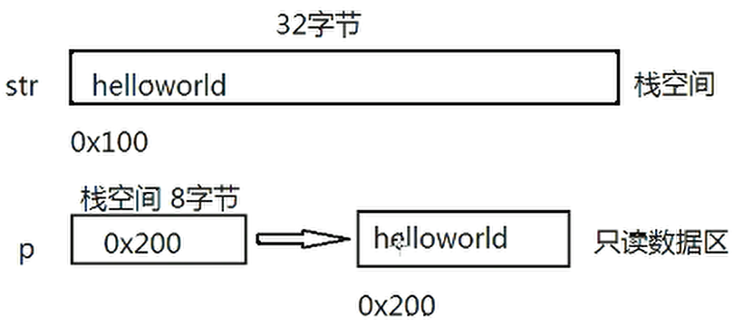

###### （2）指针与数组取元素的区别(`str[0]='x',p[0]='x'`)

```c
int main() {
    char a[32] = "helloworld";
	char *p = "helloworld"; 

    str[0]='x';//赋值，将第一个元素赋值为'x' 
    p[0]='x';//无法赋值,因为指针p所指向的元素为只读元素！ 

	return 0;
}
```

###### （3）指针与数组的长度区别

```c
#include <stdio.h>
#include <stdlib.h>

int main(){
	char str[32] = "helloworld";
	char *p = "helloworld";
	
	printf("%lu\n",sizeof(str)); //数组的长度 32 
	printf("%lu\n",sizeof(p));   //char类型的指针长度 8 
	
	return 0;
}
```

###### **（4）在函数中数组的长度与指针长度区别**

```c
#include <stdio.h>
#include <stdlib.h>

void f(int a[]){//由数组传入变为指针 
	printf("%lu\n",sizeof(a)/sizeof(a[0]));//a的长度为int *p类型的指针
}

int main(){
	int a[10] = {0};
	printf("%lu\n",sizeof(a)/sizeof(a[0]));//数组长度还是数组长度 
	f(a);
	return 0;
}
```

#### 11.笔试

```c
int a[5] = {1,2,3,4,5};

int *p1 = (int*)(&a+1);//&a表示a的整个数组地址0x10，那么加1，表示加一个数组的长度为0x114
int *p2 = (int*)((int)a+1);//(int)a,表示a的首地址如0x100强转为int型，然后加1为0x101
int *p3 = (int*)(a+1);//a首部地址,加1，变为0x100加1为0x104，即为a[2],为0x104

p1[0]= 0x114
p2[0]= 0x101
p3[0]= 0x104     
```

>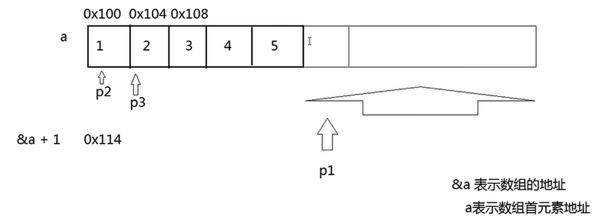

#### 12.指针数组

```c
#include <stdio.h>
#include <stdlib.h>

int main(){
	char *string[] = {"I love American","I hate China!"};
	printf("%s\n",string[0]);//0x100指向的地址	I love American
	printf("%s\n",string[1]);//0x200指向的地址	I hate China!
	return 0;
}

```

>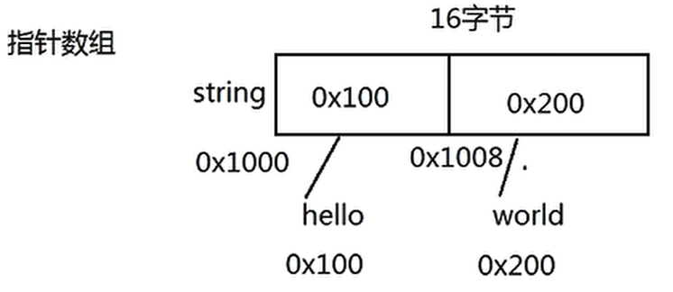

#### 13.基于指针的字符串反转

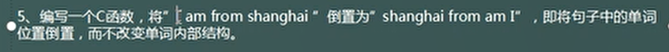

```c
#include <stdio.h>
#include <stdlib.h>

#define SIZE 5 

int main(){
	char *str[SIZE] = {0};//定义了5个的空指针 
	int i;
	
	for(i = 0; i < SIZE; i++) {
		str[i]  = (char*)malloc(sizeof(char*)*128);//一个指针可以指向一个 8*128 bit = 128B 的空间 
		scanf("%s",str[i]);
	}
	
	//反转
	char*t;
	for(i=0;i<SIZE/2;i++){
		t=str[i];
		str[i]=str[SIZE-1-i];
		str[SIZE-1-i]=t;
	}
	
	for(i = 0;i<SIZE;i++){
		printf("%s ",str[i]);
		free(str[i]);
	} 
	
	return 0;
}
```

>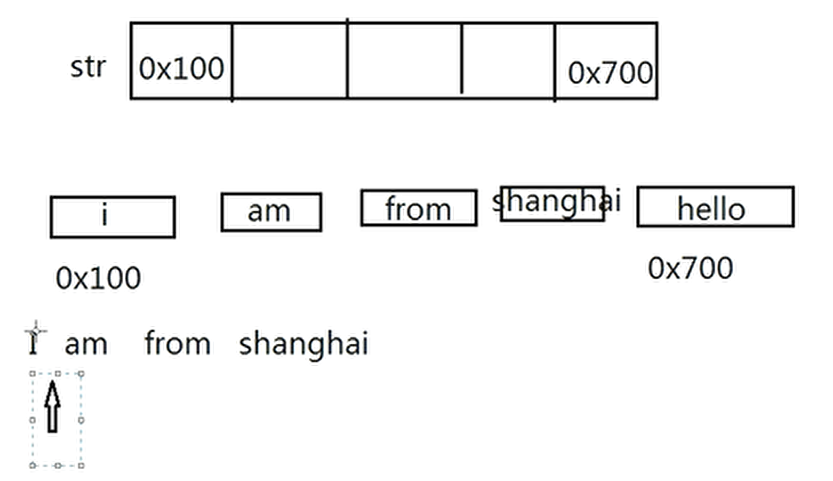

```c
#include <stdio.h>
#include <stdlib.h>

int main(){
	char *str = (char *)malloc(sizeof(char)*128); //128比特 = 32字节 
	int i=0;
	char ch;
	
	while((ch = getchar()) != '\n') {
		str[i++]=ch;
	}
	
	printf("%s\n",str);
	
	free(str);
	
	return 0;
}
```

#### 14.函数与指针的关系

###### （1）函数指针

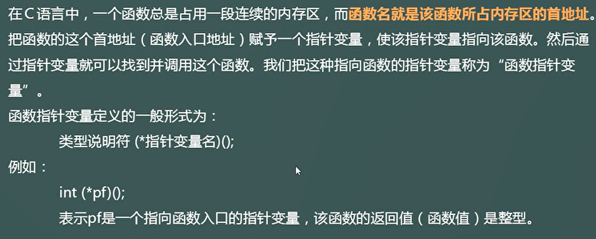

```c
#include <stdio.h>
#include <stdlib.h>

typedef int (*T)(int,int);//声明一个新的类型T，T表示函数的指针类型 

void f(){
	printf("hello world!\n");
}

int add(int x,int y) {
	return x+y;
}

int main(){
	//函数相当与一个指针 
	void (*p)();//定义函数指针
	p = f; 
	p();
	
	int (*q)(int,int) = add;//定义函数指针
	printf("%d\n",q(1,2)); 
	
	T t = add;
	printf("%d\n",t(2,3)); 
	
	return 0;
}
```

###### （2）指针函数


```c
#include <stdio.h>
#include <stdlib.h>
#include <string.h>

char *init(){//指针函数 
	// char str[32] = {0}; 栈空间，局部变量会被释放 
	char *str = (char*)malloc(128);//堆空间，可以返回，需要手动释放 
	return str;
}

int main(){
    char *s = init();
	strcpy(s,"hello");
	
	printf("%s\n",s); 
	free(s); 
	
	return 0;
}

```

###### （3）函数指针与指针函数的区别

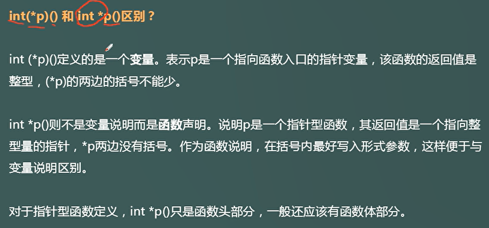

#### 15.回调函数的应用

使用回调函数进行重写

```c
#include <stdio.h>
#include <stdlib.h>
#include <string.h>

int less(int x,int y){
	return (x > y) ? 1:0;
}

int greater(int x,int y){
	return (x < y) ? 1:0;
}

void sort(int *a,int length,int (*p)(int,int)){//重写回调函数
	int i,j,num;
	for(i=0;i<length-1;i++) {
		for(j = 0;j<length-i-1;j++){
			if(p(a[j],a[j+1])){
				num = a[j];
				a[j] = a[j+1];
				a[j+1] = num;
			}
		}
	}
}

int main(){
    int a[10] = {0};
    int i;
    
    for(i=0;i<10;i++) {
    	scanf("%d",&a[i]);
	}
    
    sort(a,10,less);
    
    for(i = 0;i<10;i++) {
    	printf("%d ",a[i]);
	}
    printf("\n");
	return 0;
}
```

#### 16.[右左法则分析指针函数](https://www.bilibili.com/video/BV1k3411d7XE/?spm_id_from=333.337.search-card.all.click&vd_source=4d8bdaa129d34a4905c8db625c08e44d)

```c
int *(*(*fp)(int))[10];//fp是一个指针，指向函数，函数有一个整数形参，返回值是一个指针，指向数组，数组有10个元素，每个元素都是整形指针。
int *(*(*array[5]())();//array是一个数组，有5个元素，每个元素是指针，指向函数，没有形参，函数的返回值是指针，指向一个函数，函数的形参没有，返回值是一个整形指针。
```

#### 17.数组指针与指针数组

##### （1）指针数组

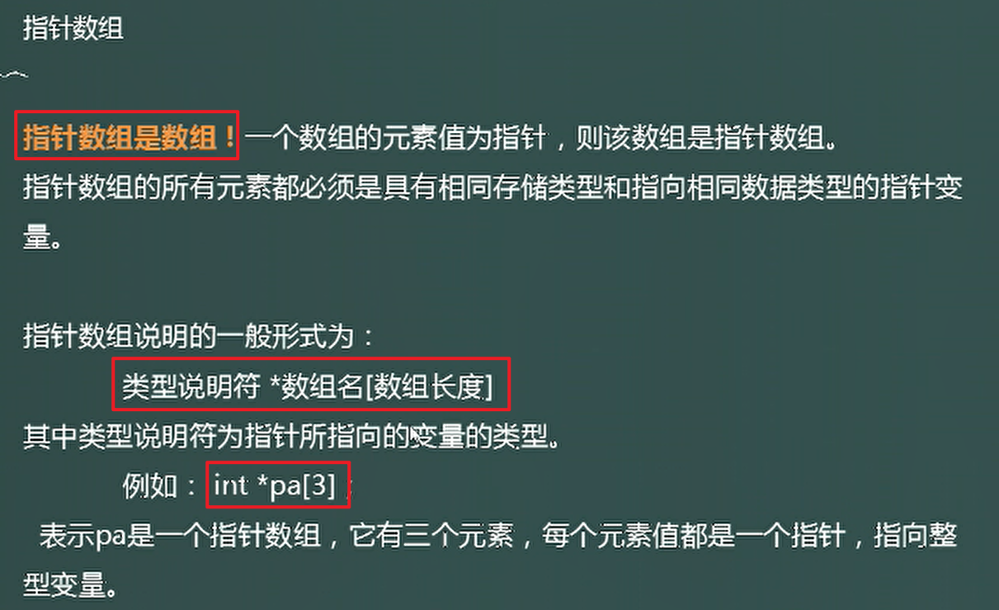

###### **"指针数组"表示二维数组**

```c
int a[][4] = {
			{60,70,80,90},
			{89,83,67,50},
			{43,78,97,66},
			{65,74,92,87}
};
	int i,j;
	//指针数组表示二维数组，本质为一个数组，数组内元素为int*类型
	int* b[4] = {a[0],a[1],a[2],a[3]}; 
	printf("sizeof(b[0]) = %d\n",sizeof(b[0]));//b[0]表示b中第一个元素，为int*类型，在64位系统中占了8B 
	printf("sizeof(b[0][0]) = %d\n",sizeof(b[0][0]));//b[0][0]表示a[0][0]，即占了4B	
	for(i=0;i<sizeof(b)/sizeof(b[0]);i++){
		for(j=0;j<4;j++){
			printf("a[%d][%d] = %d ",i,j,p[i][j]);
		}
		printf("\n");
	}
```

##### （2）数组指针

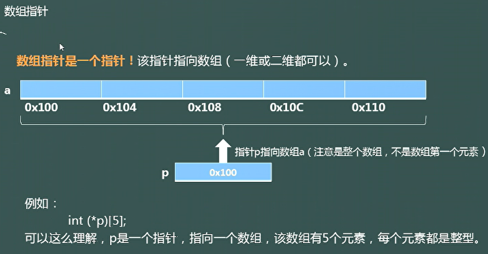

p+1 ：一次性加20个字节，取决于p这个指针指向的东西占多少个字节，由于*p指向一个数组，数组内可以放5个int类型，因此一次相加为`5*4(int 类型在64位系统占4个字节)=20`

###### **"数组指针"表示二维数组**

```c
int a[][4] = {
			{60,70,80,90},
			{89,83,67,50},
			{43,78,97,66},
			{65,74,92,87}
};
	int i,j;
	//数组指针表示二维数组，本质为一个指针，元素为int类型的一维数组 
	//a为第一行的地址，a+1加了4*4=16字节，刚好与 p指向的数组int[4]一致，也为4*4=16B 
	int (*p)[4] = a; 
	//sizeof(a)：表示a这个二维数组的大小为4*4*4=64B
	//sizeof(a[0])：表示二维数组第一行的地址为,4*4=16B 
	for(i=0;i<sizeof(a)/sizeof(a[0]);i++){
		for(j=0;j<sizeof(a[0])/sizeof(a[0][0]);j++){
			printf("a[%d][%d] = %d ",i,j,*(*(p+i)+j));
		  //printf("a[%d][%d] = %d\n",i,j,p[i][j]); 
		}
		printf("\n");
	}
```

##### （3）指针与二维数组

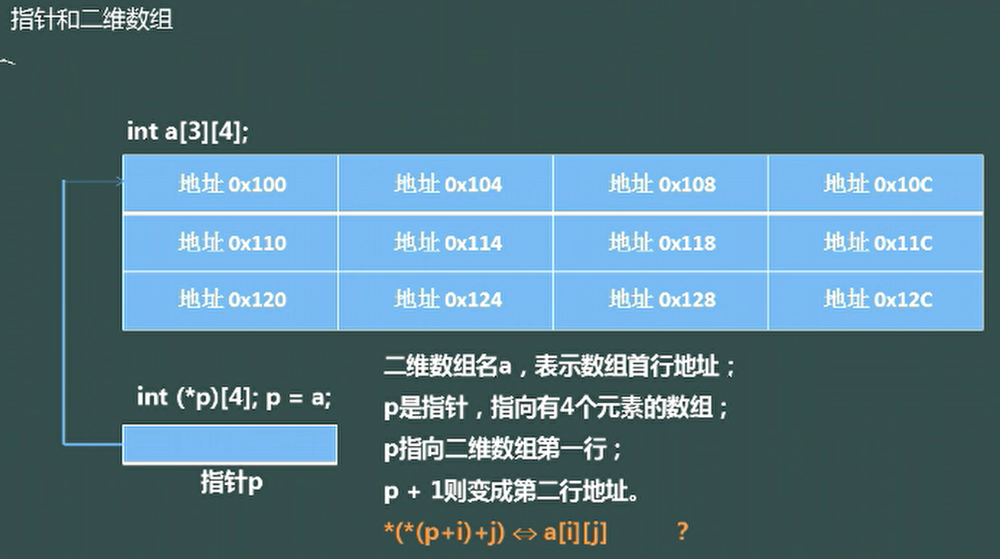

###### 用“指针”来表示二维数组

利用二维数组连续存储的特性

```c
int a[][4] = {
			{60,70,80,90},
			{89,83,67,50},
			{43,78,97,66},
			{65,74,92,87}
};
	int i,j=0,k=0;
	//t指向a的第一行、
	//因为二维数组是连续存储的所以可以根据这个特性按一维数组输出
	int *t = a[0]; 
	for(i=0;i<16;i++){
		printf("a[%d][%d] = %d ",k,j,t[i]);
		j++;
		if(j==4){
			j=0;
			printf("\n");
			k++;
		}
	}
```

##### （4）二维数组加1的关系(`a[0]、a、&a`)

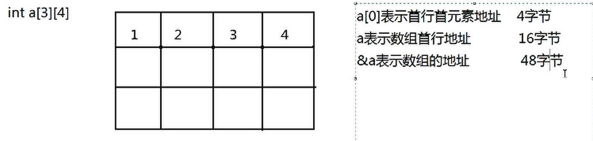

其中`a[0]`与`a`与`&a`均指向同一个地址，但代表的意思不同。

```c
	int a[][4] = {
        {60,70,80,90},
        {89,83,67,50},
        {43,78,97,66},
        {65,74,92,87}};
	printf("a = %d,a[0] = %d,&a = %d\n",*(*a),*(a[0]),*(*(*(&a))));
          //                             a = 60,a[0] = 60,&a = 60
```

(1)`a[0]`表示首行首元素的地址，即为`a[0][0]=1`,那么`a[0]+1->a[0][1]=2`

```c
int main(){
	int a[][4] = {
        {60,70,80,90},
        {89,83,67,50},
        {43,78,97,66},
        {65,74,92,87}};
	for(i=0;i<4;i++){
	    printf("a[0] + %d = %d\n",i,*(a[0]+i));	//a[0]+1一次加了4字节
	} 
	return 0;
}
```

(2)`a`表示数组首行的地址，即一行的地址(第一个一维数组的地址)，那么`a+1`即是直接加一行到`a[0][]->a[1][]`

```c
int main(){
	int a[][4] = {
        {60,70,80,90},
        {89,83,67,50},
        {43,78,97,66},
        {65,74,92,87}};
	int i;
	for(i=0;i<4;i++){
		printf("a[1][%d] = %d\n",i,*(*(a+1)+i));
        //a+1为第二行的第一个元素的地址,但a+1一次加了4*4=16个字节
        //*(a+1)提取出a[1][0]的地址为0x0001
        //*(*(a+1)+i) = a[1][i]
	} 
	return 0;
}
```

(3)`&a`也与`a`、`a[0]`的地址一样，但它指向的是整个二维数组，那么`&a + 1`就一次性加了`4*4*4=64`个字节，那么直接就越界了。

##### **详细解释**

在 C 语言中，`a[0]`、`a` 和 `&a` 虽然都指向同一个内存地址（即二维数组 `a` 的起始地址），但它们的类型不同，因此在使用指针运算或解引用时会有不同的行为。

---

###### 1. **`a[0]`、`a` 和 `&a` 的类型**

- **`a[0]`**：
  - 类型是 `int *`，即指向 `int` 的指针。
  - `a[0]` 是二维数组 `a` 的第 0 行的首元素地址。
  - 例如：`a[0]` 指向 `60` 的地址。

- **`a`**：
  - 类型是 `int (*)[4]`，即指向包含 4 个 `int` 的数组的指针。
  - `a` 是二维数组 `a` 的第 0 行的地址。
  - 例如：`a` 指向 `{60, 70, 80, 90}` 的地址。

- **`&a`**：
  - 类型是 `int (*)[4][4]`，即指向整个二维数组的指针。
  - `&a` 是整个二维数组 `a` 的地址。
  - 例如：`&a` 指向整个数组 `a` 的起始地址。

---

###### 2. **`a[0]`、`a` 和 `&a` 的值**

尽管 `a[0]`、`a` 和 `&a` 的类型不同，但它们指向的**起始地址是相同的**，即二维数组 `a` 的起始地址。

例如：
```c
printf("a[0] = %p\n", (void*)a[0]); // 输出第 0 行的首地址
printf("a = %p\n", (void*)a);       // 输出第 0 行的地址
printf("&a = %p\n", (void*)&a);     // 输出整个数组的地址
```
- 以上三行代码的输出结果会是相同的地址值。

---

###### 3. **`*(*a)`、`*(a[0])` 和 `*(*(*(&a)))` 的解释**

在你的代码中：
```c
printf("a = %d, a[0] = %d, &a = %d\n", *(*a), *(a[0]), *(*(*(&a))));
```

- **`*(*a)`**：
  - `a` 的类型是 `int (*)[4]`，即指向包含 4 个 `int` 的数组的指针。
  - `*a` 是第 0 行的首元素地址，类型是 `int *`。
  - `*(*a)` 是第 0 行的首元素值，即 `60`。

- **`*(a[0])`**：
  - `a[0]` 的类型是 `int *`，即指向 `int` 的指针。
  - `*(a[0])` 是第 0 行的首元素值，即 `60`。

- **`*(*(*(&a)))`**：
  - `&a` 的类型是 `int (*)[4][4]`，即指向整个二维数组的指针。
  - `*(&a)` 是整个二维数组 `a`，类型是 `int [4][4]`。
  - `*(*(&a))` 是第 0 行的首元素地址，类型是 `int *`。
  - `*(*(*(&a)))` 是第 0 行的首元素值，即 `60`。

---

###### 4. **为什么输出结果相同？**

- `*(*a)`、`*(a[0])` 和 `*(*(*(&a)))` 最终都访问了二维数组 `a` 的第 0 行的首元素 `60`。
- 尽管 `a[0]`、`a` 和 `&a` 的类型不同，但它们指向的起始地址相同，因此解引用后访问的值也相同。

---

###### 5. **总结**

| 表达式        | 类型            | 含义                | 值                        |
| ------------- | --------------- | ------------------- | ------------------------- |
| `a[0]`        | `int *`         | 第 0 行的首元素地址 | `60` 的地址               |
| `a`           | `int (*)[4]`    | 第 0 行的地址       | `{60, 70, 80, 90}` 的地址 |
| `&a`          | `int (*)[4][4]` | 整个二维数组的地址  | 整个数组 `a` 的地址       |
| `*(*a)`       | `int`           | 第 0 行的首元素值   | `60`                      |
| `*(a[0])`     | `int`           | 第 0 行的首元素值   | `60`                      |
| `*(*(*(&a)))` | `int`           | 第 0 行的首元素值   | `60`                      |

---

6.**代码示例**

```c
#include <stdio.h>

int main() {
    int a[][4] = {
        {60, 70, 80, 90},
        {89, 83, 67, 50},
        {43, 78, 97, 66},
        {65, 74, 92, 87}
    };

    printf("a[0] = %p\n", (void*)a[0]); // 第 0 行的首地址
    printf("a = %p\n", (void*)a);       // 第 0 行的地址
    printf("&a = %p\n", (void*)&a);     // 整个数组的地址

    printf("*(*a) = %d\n", *(*a));      // 第 0 行的首元素值*(*(a+0)+0)
    printf("*(a[0]) = %d\n", *(a[0]));  // 第 0 行的首元素值
    printf("*(*(*(&a))) = %d\n", *(*(*(&a)))); // 第 0 行的首元素值

    return 0;
}
```

---

7.**输出结果**

假设 `a` 的起始地址是 `0x1000`，则输出结果为：
```
a[0] = 0x1000
a = 0x1000
&a = 0x1000
*(*a) = 60
*(a[0]) = 60
*(*(*(&a))) = 60
```

---

8.**总结**

- `a[0]`、`a` 和 `&a` 指向同一个起始地址，但类型不同。

- `*(*a)`、`*(a[0])` 和 `*(*(*(&a)))` 都访问了二维数组 `a` 的第 0 行的首元素 `60`。

- 理解指针类型和解引用操作是掌握这类问题的关键。

  

##### **拓展**

在 C 语言中，`a` 是一个二维数组，`*a` 是对 `a` 的解引用操作。我们需要根据 `a` 的类型和内存布局来理解 `*a` 的含义。

---

###### 1. **二维数组 `a` 的定义**

```c
int a[][4] = {
    {60, 70, 80, 90},
    {89, 83, 67, 50},
    {43, 78, 97, 66},
    {65, 74, 92, 87}
};
```

- `a` 是一个二维数组，类型是 `int [4][4]`。
- `a` 的每个元素是一个包含 4 个 `int` 的一维数组。

---

###### 2. **`a` 的类型**

- `a` 的类型是 `int (*)[4]`，即指向包含 4 个 `int` 的数组的指针。
- `a` 的值是二维数组 `a` 的第 0 行的地址。

---

###### 3. **`*a` 的含义**

- `*a` 是对 `a` 的解引用操作。
- 因为 `a` 的类型是 `int (*)[4]`，所以 `*a` 的类型是 `int [4]`，即一个包含 4 个 `int` 的数组。
- `*a` 的值是二维数组 `a` 的第 0 行的首元素地址。

---

###### 4. **`*a` 的值**

- `*a` 是第 0 行的首元素地址，即 `&a[0][0]`。
- `*a` 的值是 `60` 的地址。

---

###### 5. **`**a` 的含义**

- `**a` 是对 `*a` 的解引用操作。
- 因为 `*a` 的类型是 `int [4]`，所以 `**a` 的类型是 `int`。
- `**a` 的值是第 0 行的首元素值，即 `60`。

---

###### 6. **总结**

| 表达式 | 类型         | 含义                | 值         |
| ------ | ------------ | ------------------- | ---------- |
| `a`    | `int (*)[4]` | 指向第 0 行的指针   | `&a[0]`    |
| `*a`   | `int [4]`    | 第 0 行的首元素地址 | `&a[0][0]` |
| `**a`  | `int`        | 第 0 行的首元素值   | `60`       |

---

7.**代码示例**

```c
#include <stdio.h>

int main() {
    int a[][4] = {
        {60, 70, 80, 90},
        {89, 83, 67, 50},
        {43, 78, 97, 66},
        {65, 74, 92, 87}
    };

    printf("a = %p\n", (void*)a);   // 输出第 0 行的地址
    printf("*a = %p\n", (void*)*a); // 输出第 0 行首元素的地址
    printf("**a = %d\n", **a);      // 输出第 0 行首元素的值

    return 0;
}
```

---

8.**输出结果**

假设 `a` 的起始地址是 `0x1000`，则输出结果为：
```
a = 0x1000
*a = 0x1000
**a = 60
```

---

9.**解释**

- `a` 的值是 `0x1000`，即第 0 行的地址。
- `*a` 的值也是 `0x1000`，即第 0 行首元素的地址。
- `**a` 的值是 `60`，即第 0 行首元素的值。

---

10.**总结**

- `*a` 是第 0 行的首元素地址，类型是 `int *`。
- `**a` 是第 0 行的首元素值，类型是 `int`。
- 理解指针类型和解引用操作是掌握这类问题的关键。

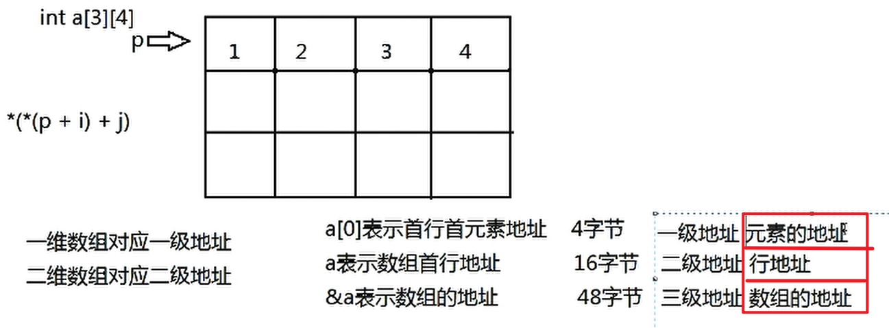

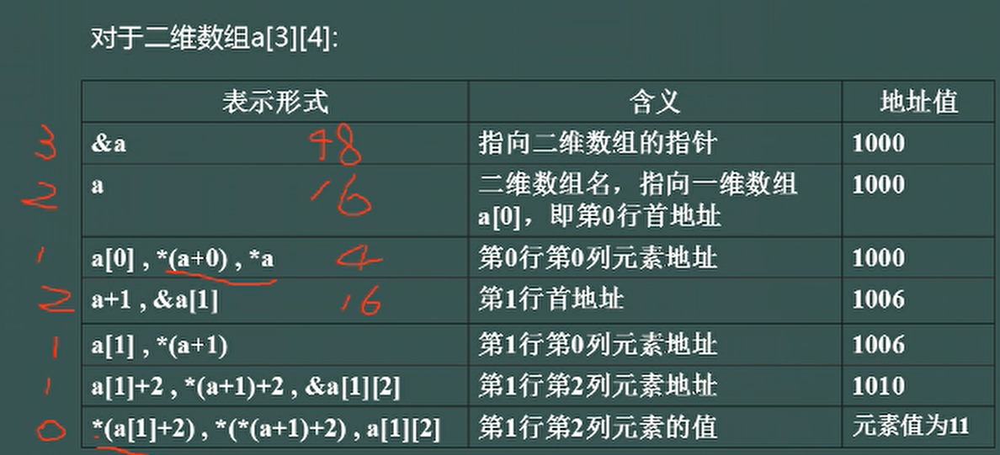

##### 面试题目

###### 1. **代码结构**

```c
int main() {
    int a[3][4] = {
        {1, 2, 3, 4},
        {3, 4, 5, 6},
        {5, 6, 7, 8}
    };
    int i;
    int (*p)[4] = a, *q = a[0]; // p 是指向包含 4 个 int 的数组的指针，q 是指向 int 的指针
    for (i = 0; i < 3; i++) {
        if (i == 0) {
            (*p)[i + i / 2] = *q + 1; // 修改数组元素
        } else {
            p++, ++q; // 移动指针
        }
    }
    for (i = 0; i < 3; i++) {
        printf("%d", a[i][i]); // 打印对角线元素
    }
    printf("%d,%d\n", *((int*)p), *q); // 打印指针指向的值
    //(int*)p,强转，指向的值不会变化，只是含义变化了，p=a[2]->p=[2][0]=5
}
```

---

###### 2.分析

- **二维数组 `a`**：
  ```c
  int a[3][4] = {
      {1, 2, 3, 4},
      {3, 4, 5, 6},
      {5, 6, 7, 8}
  };
  ```
  - `a` 是一个 3 行 4 列的二维数组。
  - 内存布局如下：
    ```
    a[0]: 1, 2, 3, 4
    a[1]: 3, 4, 5, 6
    a[2]: 5, 6, 7, 8
    ```

- **指针 `p` 和 `q`**：
  ```c
  int (*p)[4] = a; // p 是指向包含 4 个 int 的数组的指针，初始指向 a[0]
  int *q = a[0];   // q 是指向 int 的指针，初始指向 a[0][0]
  ```
  - `p` 的类型是 `int (*)[4]`，指向二维数组的一行。
  - `q` 的类型是 `int *`，指向二维数组的一个元素。

---

3. **`for` 循环分析**

第一次循环 (`i = 0`)

- 条件 `i == 0` 为真，执行：
  ```c
  (*p)[i + i / 2] = *q + 1;
  ```
  - `i + i / 2` 计算为 `0 + 0 / 2 = 0`。
  - `(*p)[0]` 是 `a[0][0]`，即 `1`。
  - `*q` 是 `a[0][0]`，即 `1`。
  - 赋值操作：`a[0][0] = 1 + 1 = 2`。
  - 修改后的数组：
    ```
    a[0]: 2, 2, 3, 4
    a[1]: 3, 4, 5, 6
    a[2]: 5, 6, 7, 8
    ```

第二次循环 (`i = 1`)

- 条件 `i == 0` 为假，执行：
  ```c
  p++, ++q;
  ```
  - `p++`：`p` 从指向 `a[0]` 移动到指向 `a[1]`。
  - `++q`：`q` 从指向 `a[0][0]` 移动到指向 `a[0][1]`。

第三次循环 (`i = 2`)

- 条件 `i == 0` 为假，执行：
  ```c
  p++, ++q;
  ```
  - `p++`：`p` 从指向 `a[1]` 移动到指向 `a[2]`。
  - `++q`：`q` 从指向 `a[0][1]` 移动到指向 `a[0][2]`。

---

4. **`for` 循环后的指针状态**

- `p` 指向 `a[2]`（第 3 行的首地址）。
- `q` 指向 `a[0][2]`（第 1 行的第 3 个元素）。

---

5. **打印对角线元素**

```c
for (i = 0; i < 3; i++) {
    printf("%d", a[i][i]);
}
```
- 打印二维数组 `a` 的对角线元素：
  - `a[0][0] = 2`
  - `a[1][1] = 4`
  - `a[2][2] = 7`
- 输出：`247`

---

6. **打印指针指向的值**

```c
printf("%d,%d\n", *((int*)p), *q);
```
- `*((int*)p)`：
  - `p` 的类型是 `int (*)[4]`，指向 `a[2]`。
  - 将 `p` 强制转换为 `int*`，然后解引用，得到 `a[2][0]`，即 `5`。
- `*q`：
  - `q` 指向 `a[0][2]`，即 `3`。
- 输出：`5,3`

	#### 18.指针的指针

##### 1.说明

定义一个`int`类型的数据，定义为`int a = 1;`,地址为`0x100`

```c
int a = 1;//地址为0x100
```

取`a`的地址，则使用`&a`,类型为`int *`

```c
int* p = &a;
```

那么取`a`地址的地址`&p`,类型为`int* *p`

```c
int**q = &p;
```

如下图所示

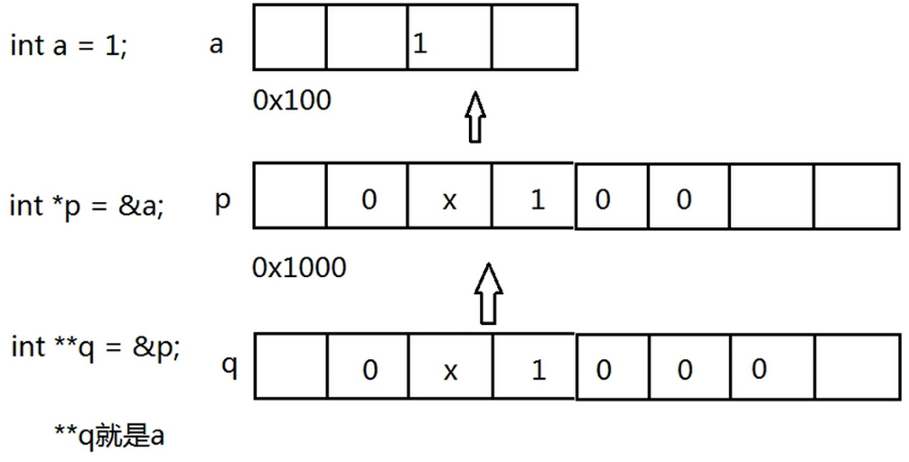

##### 2.面试题(改错)

1. **代码分析**

```c
void init(char* s) {
    s = (char *)malloc(sizeof(char) * 128); // 分配内存
}

int main() {
    char *str = NULL;
    init(str); // 调用 init 函数
    strcpy(str, "hello"); // 复制字符串
    return 0;
}
```

------

2. **错误原因**

问题 1：**指针传递方式错误**

- 在 C 语言中，函数参数是按值传递的。这意味着 `init` 函数中的 `s` 是 `main` 函数中 `str` 的一个副本。
- 在 `init` 函数中，`s` 被分配了新的内存地址，但这并不会影响 `main` 函数中的 `str`。
- 因此，`main` 函数中的 `str` 仍然是 `NULL`，导致后续的 `strcpy` 操作引发 **段错误（Segmentation Fault）**。

问题 2：**内存未正确分配**

- 由于 `init` 函数中的内存分配没有影响到 `main` 函数中的 `str`，`str` 仍然是 `NULL`。

- 当 `strcpy` 尝试将 `"hello"` 复制到 `str` 时，`str` 指向的是 `NULL`，导致程序崩溃。

  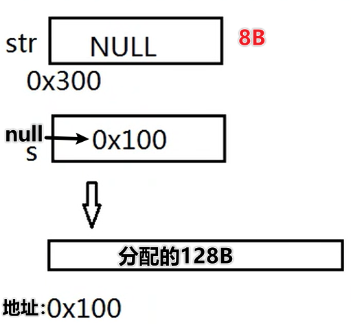

  方法 1：**使用二级指针**

  通过传递指针的指针（二级指针），可以在函数内部修改指针的值。

  ```c
  #include <stdio.h>
  #include <stdlib.h>
  #include <string.h>
  
  void init(char** s) {
      *s = (char *)malloc(sizeof(char) * 128); // 分配内存
      if (*s == NULL) {
          printf("内存分配失败\n");
          exit(1);
      }
  }
  
  int main() {
      char *str = NULL;
      init(&str); // 传递 str 的地址
      strcpy(str, "hello"); // 复制字符串
      printf("%s\n", str); // 输出字符串
      free(str); // 释放内存
      return 0;
  }
  ```

  - **解释**：
    - `init` 函数接受一个二级指针 `char** s`。
    - 在 `init` 函数中，`*s` 被分配了新的内存地址。
    - `main` 函数中的 `str` 被正确修改为指向新分配的内存。

方法 2：**返回指针**

通过函数返回值传递分配的内存地址。

```c
#include <stdio.h>
#include <stdlib.h>
#include <string.h>

char* init() {
    char* s = (char *)malloc(sizeof(char) * 128); // 分配内存
    if (s == NULL) {
        printf("内存分配失败\n");
        exit(1);
    }
    return s;
}

int main() {
    char *str = init(); // 调用 init 函数
    strcpy(str, "hello"); // 复制字符串
    printf("%s\n", str); // 输出字符串
    free(str); // 释放内存
    return 0;
}
```

- **解释**：
  - `init` 函数返回分配的内存地址。
  - `main` 函数中的 `str` 被正确初始化为指向新分配的内存。

## C语言语法易错易混汇总

####  1. %f与%lf的应用区别

%f和%lf分别是float类型和double类型用于格式化输入输出时对应的格式符号。
其中：
float，单精度浮点型，对应%f。
double,双精度浮点型，对应%lf。

在用于输出时:
float类型可以使用%lf格式，但不会有任何好处。
**double类型如果使用了%f格式可能会导致输出错误。**

在用于输入时:
**double 类型使用了%f格式，会导致输入值错误。**
float类型使用double类型不仅会导致输入错误，还可能引起程序崩溃。

所以在输入输出时，一定要区分好double和float，而使用对应的格式符号。

原文链接：https://blog.csdn.net/meme_yun/article/details/88586815

(4.2)结构体的两种命名方式

#### **2. 结构体定义方式的区别：**

##### （1）第一种方式：

```c
struct comp {
    float re;  // 实部
    float im;  // 虚部
};
```

这种方式定义了一个结构体类型 `comp`，但是每次使用 `comp` 类型时，都需要在前面加上 `struct` 关键字。例如，定义一个变量时，需要写成：

```c
struct comp a;
```

使用时也需要加上 `struct` 关键字。

##### （2）第二种方式（使用 `typedef`）：

```c
typedef struct {
    float re;  // 实部
    float im;  // 虚部
} comp;
```

这段代码不仅定义了结构体类型，还通过 `typedef` 给这个结构体类型起了一个别名 `comp`。使用这种方式定义结构体后，就不再需要加 `struct` 关键字，直接使用 `comp` 就可以了。例如，定义一个变量时：

```sql
comp a;
```

这种方式让代码变得更加简洁。

##### （3）前向声明问题

```c
typedef struct ListNode ListNode
```

使用 `typedef struct ListNode ListNode;` 是为了给结构体类型 `struct ListNode` 赋予一个新的别名 `ListNode`

`typedef` 是用来给类型定义一个别名的关键字。

这里的 `typedef struct ListNode ListNode;` 给 `struct ListNode` 类型定义了一个新的名称 `ListNode`。所以你以后可以直接使用 `ListNode` 来声明变量，而无需每次都写 `struct ListNode`。

#### 3.整除与浮点数截断的问题

如`5/9`的问题

在 C 语言中，`5/9` 是 **整数除法**，因为 5 和 9 都是整数，因此结果会是 **0**（整数除法会截断小数部分）。

```c
5/9 = 0
5.0/9 = 0.555555...
5/9.0 = 0.555555...
5.0/9.0 = 0.555555...
(float)5/9 = 0.555555...
5/(float)9 = 0.555555...    
```


#### 4.`.`与`->`的区别在`C`中

`.` 用于直接访问结构体实例的成员。

`->` 用于通过指针访问结构体实例的成员。

1. **"."（点操作符）**

- **用途**：用于访问结构体变量的成员。
- **场景**：当你有一个结构体变量时，使用 `.` 操作符来访问其成员。

**语法**：

```c
struct StructureName {
    int x;
    float y;
};

struct StructureName obj;  // 创建一个结构体变量

obj.x = 10;  // 使用 . 操作符访问成员
obj.y = 3.14;
```

**示例**：

```c
#include <stdio.h>

struct Point {
    int x;
    int y;
};

int main() {
    struct Point p1;
    p1.x = 5;  // 使用 . 操作符
    p1.y = 10; // 使用 . 操作符

    printf("Point p1: (%d, %d)\n", p1.x, p1.y);
    return 0;
}
```

2. **"->"（箭头操作符）**

- **用途**：用于访问结构体指针指向的成员。
- **场景**：当你有一个指向结构体的指针时，使用 `->` 操作符来访问结构体成员。

**语法**：

```c
struct StructureName {
    int x;
    float y;
};

struct StructureName *ptr;  // 创建一个结构体指针
ptr->x = 10;  // 使用 -> 操作符访问成员
ptr->y = 3.14;
```

**示例**：

```c
#include <stdio.h>

struct Point {
    int x;
    int y;
};

int main() {
    struct Point p1 = {5, 10};
    struct Point *ptr = &p1;  // 获取指向 p1 的指针

    printf("Point p1: (%d, %d)\n", ptr->x, ptr->y);  // 使用 -> 操作符

    return 0;
}
```

**总结：**

| 操作符 | 使用场景             | 示例           |
| ------ | -------------------- | -------------- |
| `.`    | 用于结构体变量       | `obj.x = 10;`  |
| `->`   | 用于指向结构体的指针 | `ptr->x = 10;` |

#### 5.`gets()`与`getchar()`和`puts()`与`putchar()`的区别

在 C 语言中，`gets()`、`getchar()`、`puts()` 和 `putchar()` 是用于输入输出的函数，但它们的功能和使用场景有所不同。以下是它们的区别和用法：

---

##### （1）**`gets()` 与 `getchar()` 的区别**

`gets()`

- **功能**：从标准输入（通常是键盘）读取一行字符串，直到遇到换行符（`\n`）为止，并将换行符替换为字符串结束符（`\0`）。
- **返回值**：返回读取的字符串的指针（即字符数组的首地址）。
- **特点**：
  - 读取整行输入，包括空格。
  - 不检查缓冲区大小，容易导致缓冲区溢出（不安全，已被弃用）。
- **示例**：
  ```c
  char str[100];
  gets(str); // 读取一行字符串
  ```

`getchar()`

- **功能**：从标准输入读取**单个字符**。
- **返回值**：返回读取的字符（以 `int` 类型返回，通常是 ASCII 值）。
- **特点**：
  - 每次只能读取一个字符。
  - 通常用于逐字符处理输入。
- **示例**：
  ```c
  char ch;
  ch = getchar(); // 读取一个字符
  ```

---

##### （2）**`puts()` 与 `putchar()` 的区别**

`puts()`

- **功能**：将字符串输出到标准输出（通常是屏幕），并在字符串末尾自动添加换行符（`\n`）。
- **参数**：接受一个以 `\0` 结尾的字符串（字符数组）。
- **返回值**：成功时返回非负值，失败时返回 `EOF`。
- **特点**：
  - 自动添加换行符，适合输出整行字符串。
- **示例**：
  
  ```c
  char str[] = "Hello, World!";
  puts(str); // 输出字符串并换行
  ```

`putchar()`

- **功能**：将**单个字符**输出到标准输出。
- **参数**：接受一个字符（以 `int` 类型传递，通常是 ASCII 值）。
- **返回值**：成功时返回输出的字符，失败时返回 `EOF`。
- **特点**：
  
  - 每次只能输出一个字符。
  - 适合逐字符输出。
- **示例**：
  ```c
  char ch = 'A';
  putchar(ch); // 输出字符 'A'
  ```

---

##### （3）**总结对比**

| 函数        | 功能             | 输入/输出对象 | 特点                       | 安全性 |
| ----------- | ---------------- | ------------- | -------------------------- | ------ |
| `gets()`    | 读取一行字符串   | 字符串        | 读取整行，不检查缓冲区大小 | 不安全 |
| `getchar()` | 读取单个字符     | 字符          | 逐字符读取                 | 安全   |
| `puts()`    | 输出字符串并换行 | 字符串        | 自动添加换行符             | 安全   |
| `putchar()` | 输出单个字符     | 字符          | 逐字符输出                 | 安全   |

---

##### （4）**注意事项**

1. **`gets()` 的不安全性**：
   - `gets()` 不会检查输入的长度，容易导致缓冲区溢出。建议使用更安全的替代函数 `fgets()`。
   - 示例：
     ```c
     char str[100];
     fgets(str, sizeof(str), stdin); // 安全读取一行字符串
     ```

2. **`getchar()` 的返回值**：
   
   - `getchar()` 返回的是 `int` 类型，而不是 `char` 类型。这是因为 `getchar()` 需要能够返回 `EOF`（通常是 -1），而 `char` 类型无法表示 `EOF`。
   
3. **`puts()` 的自动换行**：
   - `puts()` 会自动在输出字符串后添加换行符。如果不需要换行，可以使用 `printf()` 代替。

4. **`putchar()` 的使用场景**：
   - `putchar()` 适合逐字符输出，例如在循环中逐个输出字符。

---

##### （5）**示例代码**

以下是一个综合示例，展示了 `gets()`、`getchar()`、`puts()` 和 `putchar()` 的用法：

```c
#include <stdio.h>

int main() {
    char str[100];
    char ch;

    // 使用 gets() 读取一行字符串（不安全）
    printf("请输入一行字符串：");
    gets(str); // 不推荐使用 gets()
    printf("你输入的字符串是：");
    puts(str); // 输出字符串并换行

    // 使用 getchar() 读取单个字符
    printf("请输入一个字符：");
    ch = getchar();
    printf("你输入的字符是：");
    putchar(ch); // 输出字符
    putchar('\n'); // 手动换行

    return 0;
}
```

---

##### （6）**推荐替代方案**

- **替代 `gets()`**：使用 `fgets()`，它可以指定缓冲区大小，避免溢出。
  ```c
  char str[100];
  fgets(str, sizeof(str), stdin);
  ```

- **替代 `puts()`**：如果不需要自动换行，可以使用 `printf()`。
  ```c
  printf("%s", str); // 不自动换行
  ```

---

总结

- `gets()` 和 `getchar()` 用于输入，前者读取字符串，后者读取字符。
- `puts()` 和 `putchar()` 用于输出，前者输出字符串并换行，后者输出字符。
- `gets()` 不安全，建议使用 `fgets()` 替代。

#### 6.`static`的用法

##### （1）**`static` 用于局部变量**

当 `static` 用于函数内部的局部变量时，它的作用是：
- **延长变量的生命周期**：静态局部变量的生命周期从函数第一次调用开始，直到程序结束。
- **保持变量的值**：静态局部变量的值在函数调用之间会保留，不会被重新初始化。
- **初始化**：静态局部变量只会初始化一次（如果没有显式初始化，默认为 0）。

示例

```c
#include <stdio.h>

void func() {
    static int count = 0; // 静态局部变量
    count++;
    printf("Count: %d\n", count);
}

int main() {
    func(); // 输出：Count: 1
    func(); // 输出：Count: 2
    func(); // 输出：Count: 3
    return 0;
}
```
- **解释**：
  - `count` 是静态局部变量，它的值在函数调用之间会保留。
  - 每次调用 `func()`，`count` 的值都会增加。

---

##### （2）`static` 用于全局变量

当 `static` 用于全局变量时，它的作用是：
- **限制变量的作用域**：静态全局变量只能在定义它的文件中访问，其他文件无法访问。
- **避免命名冲突**：静态全局变量不会与其他文件中的同名全局变量冲突。

示例

```c
// file1.c
static int globalVar = 10; // 静态全局变量，只能在 file1.c 中访问

void printGlobalVar() {
    printf("GlobalVar: %d\n", globalVar);
}

// file2.c
extern int globalVar; // 错误：无法访问 file1.c 中的静态全局变量
```

---

##### （3）**`static` 用于函数**

当 `static` 用于函数时，它的作用是：
- **限制函数的作用域**：静态函数只能在定义它的文件中访问，其他文件无法调用。
- **避免命名冲突**：静态函数不会与其他文件中的同名函数冲突。

示例

```c
// file1.c
static void helper() { // 静态函数，只能在 file1.c 中调用
    printf("This is a helper function.\n");
}

void publicFunc() {
    helper(); // 可以调用静态函数
}

// file2.c
extern void helper(); // 错误：无法访问 file1.c 中的静态函数
```

---

##### （4） **`static` 的初始化规则**

- **静态变量（局部或全局）如果没有显式初始化，会被自动初始化为 0**。
- **静态变量只会初始化一次**。

示例

```c
#include <stdio.h>

void func() {
    static int x; // 未显式初始化，默认为 0
    printf("x: %d\n", x);
    x++;
}

int main() {
    func(); // 输出：x: 0
    func(); // 输出：x: 1
    func(); // 输出：x: 2
    return 0;
}
```

---

##### （5） **`static` 的内存分配**

- **静态变量存储在静态存储区**，而不是栈或堆中。
- **静态变量的内存分配在程序启动时完成**，在程序结束时释放。

---

##### （6）**`static` 的综合示例**

以下是一个综合示例，展示了 `static` 的多种用法：

```c
#include <stdio.h>

static int globalVar = 100; // 静态全局变量，只能在当前文件中访问

static void helper() { // 静态函数，只能在当前文件中调用
    printf("Helper function called.\n");
}

void func() {
    static int count = 0; // 静态局部变量
    count++;
    printf("Count: %d\n", count);
    helper(); // 调用静态函数
}

int main() {
    func(); // 输出：Count: 1，Helper function called.
    func(); // 输出：Count: 2，Helper function called.
    printf("GlobalVar: %d\n", globalVar); // 输出：GlobalVar: 100
    return 0;
}
```

---

总结

| 用法           | 作用                                               |
| -------------- | -------------------------------------------------- |
| **局部变量**   | 延长生命周期，保留值，只初始化一次。               |
| **全局变量**   | 限制作用域，避免命名冲突。                         |
| **函数**       | 限制作用域，避免命名冲突。                         |
| **初始化规则** | 未显式初始化时默认为 0，只初始化一次。             |
| **内存分配**   | 存储在静态存储区，程序启动时分配，程序结束时释放。 |

通过理解 `static` 的用法，可以更好地控制变量的作用域、生命周期和可见性，从而编写出更健壮和模块化的代码。

#### 7.`strcmp`函数

###### 1.声明

```c
//str1 -- 要进行比较的第一个字符串。
//str2 -- 要进行比较的第二个字符串。
int strcmp(const char *str1, const char *str2)
```

###### 2.返回值

该函数返回值如下：

- 如果返回值小于 0，则表示 str1 小于 str2。
- 如果返回值大于 0，则表示 str1 大于 str2。
- 如果返回值等于 0，则表示 str1 等于 str2。

#### 8.数字转字符串、字符串转数字

```c
char* itoa(int value,char*string,int radix);//value: 要转换的整数，string: 转换后的字符串,radix: 转换进制数，如2,8,10,16 进制等。
```

#### 9.`sizeof(字符串)`与`strlen(字符串)`的区别

在 C 语言中，`sizeof(字符串)` 和 `strlen(字符串)` 的作用和计算方式是不同的，主要区别如下：

##### 1. `sizeof(字符串)`

- `sizeof` 是一个 **编译时运算符**，计算的是 **变量或类型** 在内存中的 **占用字节数**。

- `sizeof("字符串")` 计算的是 **字符串字面量的大小**，包括 **末尾的空字符 `\0`**。

- 例如：

  ```c
  #include <stdio.h>
  
  int main() {
      printf("%lu\n", sizeof("Hello"));  // 输出 6 (包含末尾的 '\0')
      return 0;
  }
  ```

  解释：`"Hello"` 实际上是 `{'H', 'e', 'l', 'l', 'o', '\0'}`，一共 **6** 个字符，所以 `sizeof("Hello")` 返回 `6`。

- 如果 `sizeof` 用于字符数组，则返回 **整个数组的大小**：

  ```c
  char str[] = "Hello";
  printf("%lu\n", sizeof(str));  // 输出 6
  ```

##### 2. `strlen(字符串)`

- `strlen` 是一个 **运行时函数**（在 `<string.h>` 头文件中）。

- `strlen(字符串)` 计算的是 **字符串的实际长度（不包括 `\0` ）。**

- 例如：

  ```c
  #include <stdio.h>
  #include <string.h>
  
  int main() {
      printf("%lu\n", strlen("Hello"));  // 输出 5 (不包含 '\0')
      return 0;
  }
  ```

  解释：`strlen("Hello")` 只计算 `H`、`e`、`l`、`l`、`o`，共 **5** 个字符，不包括末尾的 `\0`。

- 如果 `strlen` 作用于字符数组：

  ```c
  char str[] = "Hello";
  printf("%lu\n", strlen(str));  // 输出 5
  ```

##### 3. 总结区别：

|                      | `sizeof(字符串)`            | `strlen(字符串)`              |
| -------------------- | --------------------------- | ----------------------------- |
| **计算方式**         | 编译时计算，返回 **字节数** | 运行时计算，返回 **字符个数** |
| **是否包括 `\0`**    | 包括 `\0`                   | 不包括 `\0`                   |
| **适用范围**         | 适用于数组、指针、变量等    | 只适用于 **C 字符串**         |
| **示例 (`"Hello"`)** | 返回 `6`                    | 返回 `5`                      |

##### 4. 对于指针字符串`sizeof`与`strlen`的区别：

- 对于指针字符串 `char *str = "Hello";`，`sizeof(str)` 计算的是指针的大小，而不是字符串的大小！

  ```c
  char *str = "Hello";
  printf("%lu\n", sizeof(str));  // 通常是 8（在 64 位系统上）
  printf("%lu\n", strlen(str));  // 输出 5
  ```

所以，如果你想获取 **字符串的实际长度**，请使用 `strlen`，而 **计算数组大小** 可以用 `sizeof`。

#### 10.指针与数组的区别

##### 1. **定义与本质**

|              | **指针（Pointer）**             | **数组（Array）**     |
| ------------ | ------------------------------- | --------------------- |
| **本质**     | 变量，存储的是 **地址**         | 一块 **连续的内存**   |
| **数据存储** | 指向某个变量或数组的 **首地址** | 直接存储 **多个元素** |

示例：

```c
int a = 10;
int *p = &a;  // p 是一个指针，存储 a 的地址

int arr[5] = {1, 2, 3, 4, 5};  // arr 是一个数组，存储 5 个整数
```

------

##### 2. **内存分配**

|                          | **指针**                                   | **数组**                                   |
| ------------------------ | ------------------------------------------ | ------------------------------------------ |
| **存储位置**             | 指针本身存储在栈或堆中，指向的地址可以变化 | 数组本身存储在栈或静态存储区，**大小固定** |
| **是否可以动态改变大小** | 可以动态分配 (`malloc/free`)               | 大小固定，不能更改                         |

示例：

```c
int *p = (int *)malloc(5 * sizeof(int));  // 指针指向动态分配的内存
free(p);  // 释放内存

int arr[5];  // 数组大小固定，不能更改
```

------

##### 3. **指针 vs 数组名**

|                           | **指针**                 | **数组名**             |
| ------------------------- | ------------------------ | ---------------------- |
| **是否是变量**            | 是一个变量，可以修改指向 | 不是变量，不能修改指向 |
| **是否可以 `++` 或 `--`** | 可以                     | 不能                   |

示例：

```c
int arr[5] = {1, 2, 3, 4, 5};
int *p = arr;  // 指针指向数组

p++;  // 指针可以移动
arr++;  // ❌ 错误，数组名不能改变指向
```

❗ **数组名是一个指向首元素的常量指针，不能修改！**

------

##### 4. **访问方式**

- **数组** 通过 `arr[i]` 访问元素
- **指针** 通过 `*(p + i)` 访问元素

示例：

```c
int arr[5] = {1, 2, 3, 4, 5};
int *p = arr;

printf("%d\n", arr[2]);  // 3
printf("%d\n", *(p + 2));  // 3
```

💡 `arr[i]` 和 `*(arr + i)` 是等价的。

------

##### 5. **sizeof 的区别**

|                   | **指针**                        | **数组**                                |
| ----------------- | ------------------------------- | --------------------------------------- |
| **`sizeof(ptr)`** | 指针变量的大小（通常 4/8 字节） | 整个数组的大小（`元素大小 × 元素个数`） |
| **`sizeof(arr)`** | 计算整个数组的大小              | 计算整个数组的大小                      |

示例：

```c
int arr[5] = {1, 2, 3, 4, 5};
int *p = arr;

printf("%lu\n", sizeof(arr));  // 20 (5 * sizeof(int))
printf("%lu\n", sizeof(p));  // 8 (在 64 位系统上)
```

------

##### 6. **作为函数参数**

- **数组作为函数参数时，退化为指针！**
- **无法在函数内部获取数组的大小**

示例：

```c
void func(int arr[]) {
    printf("%lu\n", sizeof(arr));  // 8 (在 64 位系统上)
}

int main() {
    int arr[5] = {1, 2, 3, 4, 5};
    func(arr);
}
```

💡 **`arr` 作为参数传递时，变成了 `int \*arr`，所以 `sizeof(arr)` 变成指针大小，而不是数组大小！**

------

##### 7. **动态数组 vs 静态数组**

|                    | **静态数组**   | **动态数组（指针）**       |
| ------------------ | -------------- | -------------------------- |
| **分配方式**       | 直接在栈上分配 | 在堆上分配 (`malloc/free`) |
| **是否能改变大小** | 不能           | 可以                       |
| **释放方式**       | 自动释放       | 需要 `free()`              |

示例：

```c
int *p = (int *)malloc(5 * sizeof(int));  // 动态分配
free(p);  // 释放
```

------

##### 8. **总结**

|                       | **指针**             | **数组**     |
| --------------------- | -------------------- | ------------ |
| **存储内容**          | 地址                 | 元素         |
| **是否可修改指向**    | 可以                 | 不能         |
| **是否动态分配**      | 可以 (`malloc/free`) | 不能         |
| **`sizeof` 计算方式** | 指针本身大小         | 整个数组大小 |
| **作为函数参数**      | 直接传递指针         | 退化为指针   |

------

💡 **使用建议**

- **固定大小的存储** 用数组
- **动态分配内存** 用指针 (`malloc/free`)
- **传递数组到函数** 用指针，但要额外传递大小参数

