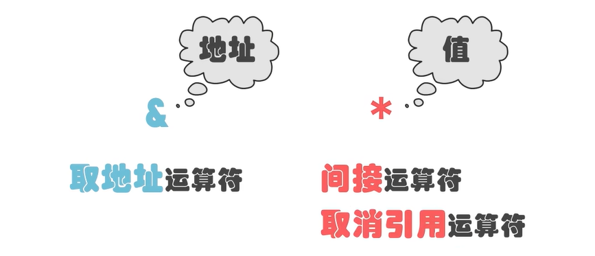
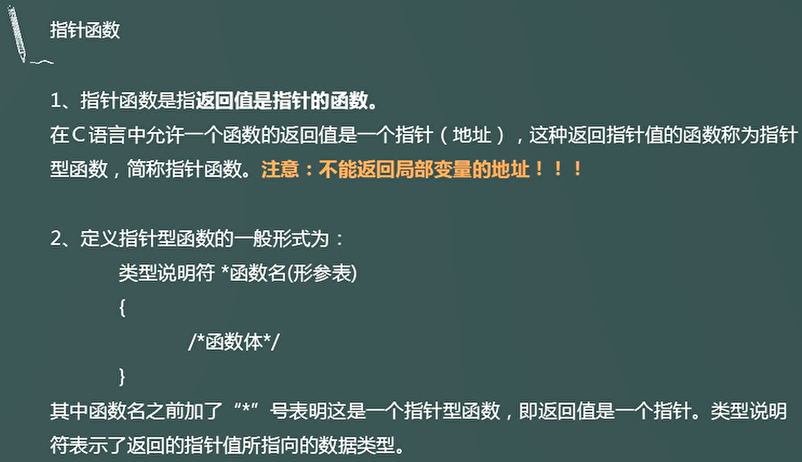

## 指针和引用

一个学习网站：[前 Free 门课程 - 在线学习 Free](https://www.coursera.org/courses?query=free)

一个超级论坛：[最新问题 - Stack Overflow](https://stackoverflow.com/questions)

#### 1.取地址和指针



#### 2.*的意义

（1）

```c
int *p = &a;//表示将a的地址赋值给int类型的指针p
    *p = 100;//将*p指针对应的值赋值为100
```


#### 3.不同类型指针的长度与不同类型的长度对比

```c
#include <stdio.h>
 
int main()
{
    int *int_ptr;
    char *char_ptr;
    float *float_ptr;
    double *double_ptr;
 
    printf("int 指针的长度: %zu 字节\n", sizeof(int_ptr));
    printf("char 指针的长度: %zu 字节\n", sizeof(char_ptr));
    printf("float 指针的长度: %zu 字节\n", sizeof(float_ptr));
    printf("double 指针的长度: %zu 字节\n", sizeof(double_ptr));
 
    return 0;
}
```

输出结果

**32位系统**

```
int 指针的长度: 4 字节
char 指针的长度: 4 字节
float 指针的长度: 4 字节
double 指针的长度: 4 字节
```

64位系统

```
int 指针的长度: 8 字节
char 指针的长度: 8 字节
float 指针的长度: 8 字节
double 指针的长度: 8 字节
```

- **指针的长度与系统架构有关**：***\*在 32 位系统中，所有指针的长度都是 4 个字节；在 64 位系统中，所有指针的长度都是 8 个字节\****。
- **指针的长度与指向的数据类型无关：无论指针指向 int、char、float 还是 double，指针本身的长度是固定的，由系统的位数决定。**

**C语言的不同类型长度**


C中不同数据类型所占的字节大小，在不同的操作系统和编译器下，是不同的，一般主要说[gcc](https://so.csdn.net/so/search?q=gcc&spm=1001.2101.3001.7020)下，32位或64位系统的，红色部分是32和64位系统不同的。


归纳总结：除了指针和long随操作系统变化之外，其他均不变（32位与64位操作系统比较）。

> 注意：
> 1.Linux下long是8字节，Windows下是4字节。
> 2.string的大小：32位和64位下string差4byte，其实就是一个指针的差别。string内部并不保存字符串本身，而是保存了一个指向字符串开头的指针。

#### 4.不同指针的“步长”区别，赋值时的指针应用

```c
#include <stdio.h>

int main(){
    int num = 1;
    int *p = &num; *p = 100; //等价于 int num = 100; 
    printf("num = %d" , num);
    
    char ch = 'a';
    //int *q = &ch ,会导致类型不兼容
    char *q = &ch;
    *q = 'x';
    
    printf("%c\n",ch); //输出 x
    printf("%p\n",p);  //输出 0x7fffd75878b4
    printf("%p\n",q);  //输出 0x7fffd75878b3
    
    printf("%p\n",p+1); //输出0x7fffd75878b8，p指向的是整数，整数占4个字节，所以p+1加4个字节
    printf("%p\n",q+1); //输出0x7fffd75878b4，q指向的是字符，字符占1个字节，所以q+1加1个字节
    return 0;
}
```

#### 5.指针在函数参数的使用

典型错误，由于自定义函数最后栈空间被释放，因此a,b在主函数没有交换

```c
#include <stdio.h>
#include <stdlib.h>

void swap(int x,int y){
	int t = x;
	x = y;
	y = t;
}

int main() {
	int a = 1; int b = 2;
	swap(a,b);
	printf("a = %d, b = %d\n",a,b); 
	
	return 0;
}
```


正确解法：如果要交换实参的值， 必须要传地址 

```c
#include <stdio.h>
#include <stdlib.h>

void swap(int *x,int *y){
	int t = *x;
	*x = *y;
	*y = t;
}

int main() {
	int a = 1; int b = 2;
	swap(&a,&b);//如果要交换实参的值， 必须要传地址 
	printf("a = %d, b = %d\n",a,b); 
	
	return 0;
}
```


#### 6.`*pa++与 (*pa)++与 ++*pa`区别

```c
int main() {
	int a,*pa = &a,*pb; 
	//int a; 
	//int *pa = &a;       pa指向a的地址 
	//int *pb;            声明pb指针 

	pb = pa;
    //    pa = pb             pb也指向a的地址 
    
    int x = 3,y = 0,*pa = &x;
	y = *pa+5;    //y = 8 
	y = ++*pa;    //先执行++,然后将值赋值给y 
	printf("y = %d,*pa = %d\n",y,*pa);//y = 4,*pa = 4 
    //*pa++与(*pa)++的区别 	
	//y = *pa++;  //执行pa++，会形成野指针，即为指向y的地址的下一位，显然这是非法区 
	y = (*pa)++;  //先执行赋值，然后再执行++ 
	printf("y = %d,*pa = %d\n",y,*pa);//y = 4,*pa = 5
	 
	return 0;
}
```


完成`strcpy`的函数指针应用（*pa++应用）

```c
#include <stdio.h>
#include <stdlib.h>

void mystrcpy(char*dest,const char*src) {
	while(*src != '\0'){ //先判断再赋值
		*dest++ = *src++;
	}
}

int main() {
    char s1[32] = "hello";//实际上 h e l l o /0
    char s2[32] = 123456789;
    
    mystrcpy(s2,s1);
    
    printf("%s\n",s2);
	 
	return 0;
}

```

输出：

```
hello6789
```

改进

```c
#include <stdio.h>
#include <stdlib.h>

void mystrcpy(char*dest,const char*src) {//先赋值再判断
	while((*dest++ = *src++)!= '\0');//判断*dest是否到了'\0',如果到了，即可结束，否者继续
}

//或者
void mystrcpy(char* dest, const char* src) {
    while(*src != '\0') {  // 当 src 还未到字符串末尾时
        *dest = *src;      // 将 src 当前字符复制到 dest
        dest++;            // 移动 dest 指针到下一个位置
        src++;             // 移动 src 指针到下一个位置
    }
    *dest = '\0';          // 添加字符串结束符
}


int main() {
    char s1[32] = "hello";
    char s2[32] = "123456789";
    
    mystrcpy(s2,s1);
    
    printf("%s\n",s2);
	 
	return 0;
}
```

输出

```c
hello
```

7. #### `const`的用法

```c
#include <stdio.h>
#include <stdlib.h>

int main() {
    int num;
	
	const int *p1 = &num; //const 修饰 *p1,也即为num 
	//(*p1)++; num++;   即为非法 
	p1++;//虽然是野指针，但可以编译通过 
	
	int *const p2 = &num;//const修饰p2
	//p2++;即为非法 
	 
	(*pa)++;
	
	const int *const p3 = &num;//const即修饰*p3（也num）,也修饰p3 
	 
	return 0;
}
```

#### 8.空指针与野指针及其解决方法(`malloc()，free()，int a;`等)

```c
#include <stdio.h>
#include <stdlib.h>

int main() {
    int *p;
	// *p = 100; 错误原因:*p指向的内存为随机内存，如果直接使用，视为非法，这段内存可能正在被其他程序使用！
	
	int *p = NULL; //因此，一般将*p指向的内存设置为NULL，这样就不会乱指向其他内存
	//*p = 100; 当然仍然不可以使用直接赋值！
	
	//方案一：系统分配内存
	int a; 
	int *p1 = &a;
	
	//方案二：用户申请内存（堆内存）
	char *str = (char*)malloc(32);//申请32比特,8字节 
	//char *str = (char*)malloc(sizeof(char*));
	
	free(str);
	str = NULL;//因为str所指向的地址空间已被释放，因此应该把原来str指向的地址清空！	 
	return 0;
}

```

#### 9.练习：去掉字符串中的空格

输入一段字符串，如`hello___world___aa___bb`，输出`"helloworldaabb"`.

- (1)如何输入空格？`scanf()`遇到"空格"、"`\n`"会默认结束

解决方案：

```c
scanf("%[^\n]",str);//表示仅遇到\n结束
gets(str);//从输入缓冲区中读取一个字符串存储到字符指针变量 str 所指向的内存空间

char ch;
int i = 0;
while((ch = getchar()) != '\n') {
    *(str + i++) = ch;
}
```

>`get()`函数的用法，“从输入缓冲区中读取一个字符串存储到字符指针变量 `str` 所指向的内存空间”。
>
>```c
># include <stdio.h>
>int main(void)
>{
>    char str[20] = "\0";  //字符数组初始化\0
>    printf("请输入字符串：");
>    gets(str);
>    printf("%s\n", str);
>    return 0;
>}
>```
>
>输出
>
>```
>请输入字符串：i love you
>i love you
>```
>
>可见，`gets()` 函数不仅比` scanf` 简洁，而且，就算输入的字符串中有空格也可以直接输入，不用像 `scanf` 那样要定义多个[字符数组](https://so.csdn.net/so/search?q=字符数组&spm=1001.2101.3001.7020)。也就是说:
>
>```c
>gets(str);
>```
>
>完全可以取代:
>
>```c
>scanf("%s", string);
>```

代码

```c
#include <stdio.h>
#include <stdlib.h>

void delete_space(char* s){
	while(*s != '\0'){
		*s = *(s+1);
		s++;
	}
}

int main(){
//	//方案一 : %[^/n] 
//	char * str = (char*)malloc(128);//声明一个指针
//	scanf("%[^\n]",str);
//	printf("%s\n",str);
//	//方案二：gets();
//	char str1[10] = "/0";
//	gets(str1);
//	printf("%s\n",str1);  
//方案三：getchar();	 
	char *str3 = (char*)malloc(128);//声明一个指针
	char ch;
	int i;
	while((ch = getchar())!= '\n'){
		*(str3 + i++ ) = ch; 
	} 
//	printf("%s\n",str3);
	char *begin = str3;
	while(*str3 != '\0'){
		if(*str3 == ' '){
			delete_space(str3);
		} else {
			str3++;
		}
	}
	printf("%s\r\n",begin);
	//printf("%s\r\n",*begin);
	return 0;
} 

```

输出结果

```
输入：aa  bb  cc  
输出:aabbcc
```

#### 10.指针和数组

指针和数组在使用的方面是没有区别的。

```c
#include <stdlib.h> 
#include <stdio.h>

int main(){
	int i;
	int a[5] = {1,2,3,4,5};
	for(i = 0;i<5;i++){
		printf("%d\n",a[i]);
	}
	printf("================\n");
	int *p = a;//通过指针的形式访问数组 
	//int *p = &a;
	for(i = 0;i <5;i++){
		printf("%d\n",*(p+i));
	} 
	printf("================\n");
    char *pa = "helloworld";//通过指针的形式访问字符串 
	for(i=0;i<10;i++){
		printf("%c",*(pa+i));
	} 
	return 0;
}
```

###### （1）指针与数组++的区别

```c
#include <stdlib.h> 
#include <stdio.h>

int main() {
    char a[32] = "helloworld";
	char *p = "helloworld"; 

    a++;//会报错，因为a在栈空间中仅仅指向a的字符串首元素，+1相当与将这个字符串整体平移4个字节(1个位置),显然后续4个字节为非法区 
    p++;//不会报错，会取出‘e’ 
    
    char *const q = "helloworld";
    q++;//不可以,const修饰的是指针p，指针p不可以进行操作 

	return 0;
}
```

>
>
>

###### （2）指针与数组取元素的区别(`str[0]='x',p[0]='x'`)

```c
int main() {
    char a[32] = "helloworld";
	char *p = "helloworld"; 

    str[0]='x';//赋值，将第一个元素赋值为'x' 
    p[0]='x';//无法赋值,因为指针p所指向的元素为只读元素！ 

	return 0;
}
```

###### （3）指针与数组的长度区别

```c
#include <stdio.h>
#include <stdlib.h>

int main(){
	char str[32] = "helloworld";
	char *p = "helloworld";
	
	printf("%lu\n",sizeof(str)); //数组的长度 32 
	printf("%lu\n",sizeof(p));   //char类型的指针长度 8 
	
	return 0;
}
```

###### **（4）在函数中数组的长度与指针长度区别**

```c
#include <stdio.h>
#include <stdlib.h>

void f(int a[]){//由数组传入变为指针 
	printf("%lu\n",sizeof(a)/sizeof(a[0]));//a的长度为int *p类型的指针
}

int main(){
	int a[10] = {0};
	printf("%lu\n",sizeof(a)/sizeof(a[0]));//数组长度还是数组长度 
	f(a);
	return 0;
}
```

#### 11.笔试

```c
int a[5] = {1,2,3,4,5};

int *p1 = (int*)(&a+1);//&a表示a的整个数组地址0x10，那么加1，表示加一个数组的长度为0x114
int *p2 = (int*)((int)a+1);//(int)a,表示a的首地址如0x100强转为int型，然后加1为0x101
int *p3 = (int*)(a+1);//a首部地址,加1，变为0x100加1为0x104，即为a[2],为0x104

p1[0]= 0x114
p2[0]= 0x101
p3[0]= 0x104     
```

>

#### 12.指针数组

```c
#include <stdio.h>
#include <stdlib.h>

int main(){
	char *string[] = {"I love American","I hate China!"};
	printf("%s\n",string[0]);//0x100指向的地址	I love American
	printf("%s\n",string[1]);//0x200指向的地址	I hate China!
	return 0;
}

```

>

#### 13.基于指针的字符串反转


```c
#include <stdio.h>
#include <stdlib.h>

#define SIZE 5 

int main(){
	char *str[SIZE] = {0};//定义了5个的空指针 
	int i;
	
	for(i = 0; i < SIZE; i++) {
		str[i]  = (char*)malloc(sizeof(char*)*128);//一个指针可以指向一个 8*128 bit = 128B 的空间 
		scanf("%s",str[i]);
	}
	
	//反转
	char*t;
	for(i=0;i<SIZE/2;i++){
		t=str[i];
		str[i]=str[SIZE-1-i];
		str[SIZE-1-i]=t;
	}
	
	for(i = 0;i<SIZE;i++){
		printf("%s ",str[i]);
		free(str[i]);
	} 
	
	return 0;
}
```

>

```c
#include <stdio.h>
#include <stdlib.h>

int main(){
	char *str = (char *)malloc(sizeof(char)*128); //128比特 = 32字节 
	int i=0;
	char ch;
	
	while((ch = getchar()) != '\n') {
		str[i++]=ch;
	}
	
	printf("%s\n",str);
	
	free(str);
	
	return 0;
}
```

#### 14.函数与指针的关系

###### （1）函数指针


```c
#include <stdio.h>
#include <stdlib.h>

typedef int (*T)(int,int);//声明一个新的类型T，T表示函数的指针类型 

void f(){
	printf("hello world!\n");
}

int add(int x,int y) {
	return x+y;
}

int main(){
	//函数相当与一个指针 
	void (*p)();//定义函数指针
	p = f; 
	p();
	
	int (*q)(int,int) = add;//定义函数指针
	printf("%d\n",q(1,2)); 
	
	T t = add;
	printf("%d\n",t(2,3)); 
	
	return 0;
}
```

###### （2）指针函数



```c
#include <stdio.h>
#include <stdlib.h>
#include <string.h>

char *init(){//指针函数 
	// char str[32] = {0}; 栈空间，局部变量会被释放 
	char *str = (char*)malloc(128);//堆空间，可以返回，需要手动释放 
	return str;
}

int main(){
    char *s = init();
	strcpy(s,"hello");
	
	printf("%s\n",s); 
	free(s); 
	
	return 0;
}

```

###### （3）函数指针与指针函数的区别


#### 15.回调函数的应用

使用回调函数进行重写

```c
#include <stdio.h>
#include <stdlib.h>
#include <string.h>

int less(int x,int y){
	return (x > y) ? 1:0;
}

int greater(int x,int y){
	return (x < y) ? 1:0;
}

void sort(int *a,int length,int (*p)(int,int)){//重写回调函数
	int i,j,num;
	for(i=0;i<length-1;i++) {
		for(j = 0;j<length-i-1;j++){
			if(p(a[j],a[j+1])){
				num = a[j];
				a[j] = a[j+1];
				a[j+1] = num;
			}
		}
	}
}

int main(){
    int a[10] = {0};
    int i;
    
    for(i=0;i<10;i++) {
    	scanf("%d",&a[i]);
	}
    
    sort(a,10,less);
    
    for(i = 0;i<10;i++) {
    	printf("%d ",a[i]);
	}
    printf("\n");
	return 0;
}
```

#### 16.右左法则分析指针函数

```c
int *(*(*fp)(int))[10];//fp是一个指针，指向函数，函数有一个整数形参，返回值是一个指针，指向数组，数组有10个元素，每个元素都是整形指针。
int *(*(*array[5]())();//array是一个数组，有5个元素，每个元素是指针，指向函数，没有形参，函数的返回值是指针，指向一个函数，函数的形参没有，返回值是一个整形指针。
```

#### 17.数组指针与指针数组

##### （1）指针数组


##### （2）数组指针


p+1 ：一次性加20个字节

##### （3）指针与二维数组


##### （4）二位数组加1的关系


一维数组对应一级地址

二维数组对应二级地址

三维数组对应三级地址


#####  (5.1) %f与%lf的应用区别

%f和%lf分别是float类型和double类型用于格式化输入输出时对应的格式符号。
其中：
float，单精度浮点型，对应%f。
double,双精度浮点型，对应%lf。

在用于输出时:
float类型可以使用%lf格式，但不会有任何好处。
**double类型如果使用了%f格式可能会导致输出错误。**

在用于输入时:
**double 类型使用了%f格式，会导致输入值错误。**
float类型使用double类型不仅会导致输入错误，还可能引起程序崩溃。

所以在输入输出时，一定要区分好double和float，而使用对应的格式符号。

原文链接：https://blog.csdn.net/meme_yun/article/details/88586815

(4.2)结构体的两种命名方式

##### **(5.2) 结构体定义方式的区别：**

###### 1.第一种方式：

```c
struct comp {
    float re;  // 实部
    float im;  // 虚部
};
```

这种方式定义了一个结构体类型 `comp`，但是每次使用 `comp` 类型时，都需要在前面加上 `struct` 关键字。例如，定义一个变量时，需要写成：

```c
struct comp a;
```

使用时也需要加上 `struct` 关键字。

###### 2.第二种方式（使用 `typedef`）：

```c
typedef struct {
    float re;  // 实部
    float im;  // 虚部
} comp;
```

这段代码不仅定义了结构体类型，还通过 `typedef` 给这个结构体类型起了一个别名 `comp`。使用这种方式定义结构体后，就不再需要加 `struct` 关键字，直接使用 `comp` 就可以了。例如，定义一个变量时：

```sql
comp a;
```

这种方式让代码变得更加简洁。

###### 3.前向声明问题

```c
typedef struct ListNode ListNode
```

使用 `typedef struct ListNode ListNode;` 是为了给结构体类型 `struct ListNode` 赋予一个新的别名 `ListNode`

`typedef` 是用来给类型定义一个别名的关键字。

这里的 `typedef struct ListNode ListNode;` 给 `struct ListNode` 类型定义了一个新的名称 `ListNode`。所以你以后可以直接使用 `ListNode` 来声明变量，而无需每次都写 `struct ListNode`。

##### (5.3)整除与浮点数截断的问题

如`5/9`的问题

在 C 语言中，`5/9` 是 **整数除法**，因为 5 和 9 都是整数，因此结果会是 **0**（整数除法会截断小数部分）。

```c
5/9 = 0
5.0/9 = 0.555555...
5/9.0 = 0.555555...
5.0/9.0 = 0.555555...
(float)5/9 = 0.555555...
5/(float)9 = 0.555555...    
```


##### (5.4)`.`与`->`的区别在`C`中

`.` 用于直接访问结构体实例的成员。

`->` 用于通过指针访问结构体实例的成员。

1. **"."（点操作符）**

- **用途**：用于访问结构体变量的成员。
- **场景**：当你有一个结构体变量时，使用 `.` 操作符来访问其成员。

**语法**：

```c
struct StructureName {
    int x;
    float y;
};

struct StructureName obj;  // 创建一个结构体变量

obj.x = 10;  // 使用 . 操作符访问成员
obj.y = 3.14;
```

**示例**：

```c
#include <stdio.h>

struct Point {
    int x;
    int y;
};

int main() {
    struct Point p1;
    p1.x = 5;  // 使用 . 操作符
    p1.y = 10; // 使用 . 操作符

    printf("Point p1: (%d, %d)\n", p1.x, p1.y);
    return 0;
}
```

2. **"->"（箭头操作符）**

- **用途**：用于访问结构体指针指向的成员。
- **场景**：当你有一个指向结构体的指针时，使用 `->` 操作符来访问结构体成员。

**语法**：

```c
struct StructureName {
    int x;
    float y;
};

struct StructureName *ptr;  // 创建一个结构体指针
ptr->x = 10;  // 使用 -> 操作符访问成员
ptr->y = 3.14;
```

**示例**：

```c
#include <stdio.h>

struct Point {
    int x;
    int y;
};

int main() {
    struct Point p1 = {5, 10};
    struct Point *ptr = &p1;  // 获取指向 p1 的指针

    printf("Point p1: (%d, %d)\n", ptr->x, ptr->y);  // 使用 -> 操作符

    return 0;
}
```

**总结：**

| 操作符 | 使用场景             | 示例           |
| ------ | -------------------- | -------------- |
| `.`    | 用于结构体变量       | `obj.x = 10;`  |
| `->`   | 用于指向结构体的指针 | `ptr->x = 10;` |

