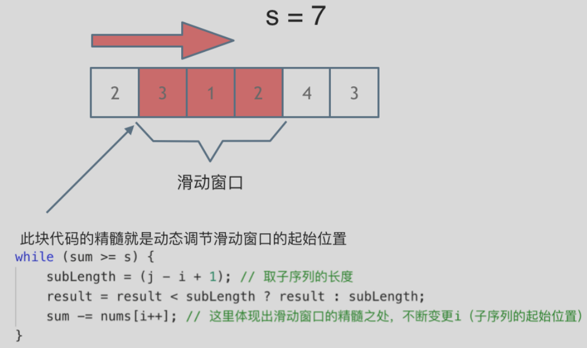
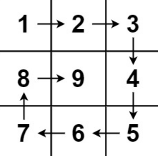
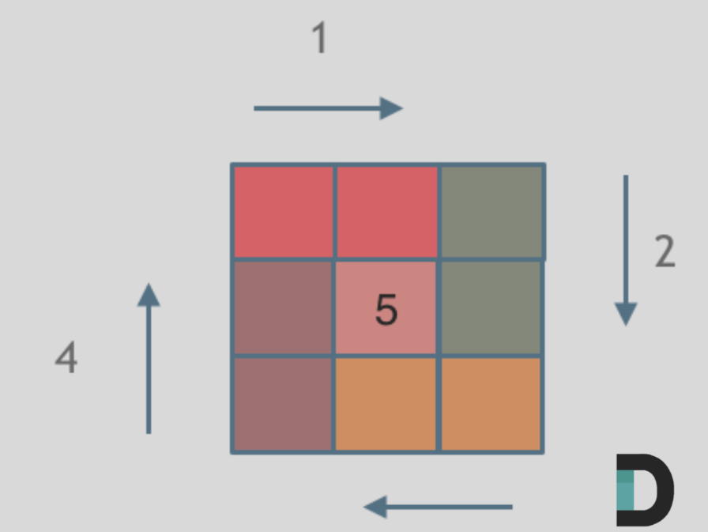
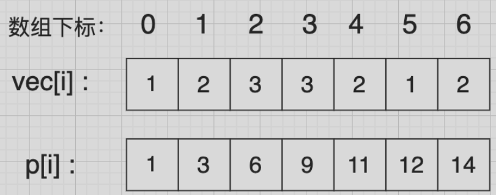
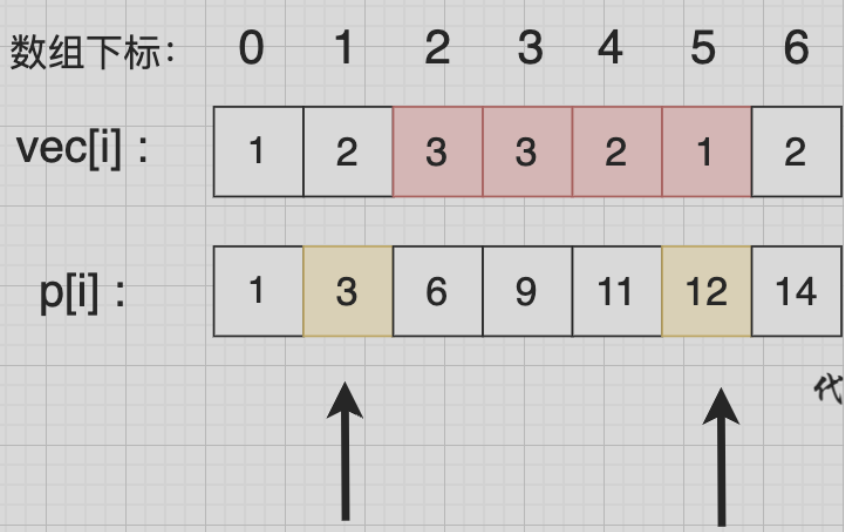

# 数组

## 1.数组基础理论

**数组是存放在连续内存空间上的相同类型数据的集合。**

数组可以方便的通过下标索引的方式获取到下标对应的数据。

举一个字符数组的例子，如图所示：


需要两点注意的是

- **数组下标都是从0开始的。**
- **数组内存空间的地址是连续的**

正是**因为数组在内存空间的地址是连续的，所以我们在删除或者增添元素的时候，就难免要移动其他元素的地址。**

例如删除下标为3的元素，需要对下标为3的元素后面的所有元素都要做移动操作，如图所示：


而且大家如果使用C++的话，要注意vector 和 array的区别，vector的底层实现是array，严格来讲vector是容器，不是数组。

**数组的元素是不能删的，只能覆盖。**

那么二维数组直接上图，大家应该就知道怎么回事了


**那么二维数组在内存的空间地址是连续的么？**

不同编程语言的内存管理是不一样的，以C++为例，在C++中二维数组是连续分布的。

我们来做一个实验，C++测试代码如下：

```c++
void test_arr() {
    int array[2][3] = {
		{0, 1, 2},
		{3, 4, 5}
    };
    cout << &array[0][0] << " " << &array[0][1] << " " << &array[0][2] << endl;
    cout << &array[1][0] << " " << &array[1][1] << " " << &array[1][2] << endl;
}

int main() {
    test_arr();
}
```

```sql
0x7ffee4065820 0x7ffee4065824 0x7ffee4065828
0x7ffee406582c 0x7ffee4065830 0x7ffee4065834
```

注意地址为16进制，可以看出二维数组地址是连续一条线的。

一些录友可能看不懂内存地址，我就简单介绍一下， 0x7ffee4065820 与 0x7ffee4065824 差了一个4，就是4个字节，因为这是一个int型的数组，所以两个相邻数组元素地址差4个字节。

0x7ffee4065828 与 0x7ffee406582c 也是差了4个字节，在16进制里8 + 4 = c，c就是12。

如图：


**所以可以看出在C++中二维数组在地址空间上是连续的**。

像Java是没有指针的，同时也不对程序员暴露其元素的地址，寻址操作完全交给虚拟机。

所以看不到每个元素的地址情况，这里我以Java为例，也做一个实验。

```java
public static void test_arr() {
    int[][] arr = {{1, 2, 3}, {3, 4, 5}, {6, 7, 8}, {9,9,9}};
    System.out.println(arr[0]);
    System.out.println(arr[1]);
    System.out.println(arr[2]);
    System.out.println(arr[3]);
}
```

```sql
[I@7852e922
[I@4e25154f
[I@70dea4e
[I@5c647e05
```

这里的数值也是16进制，这不是真正的地址，而是经过处理过后的数值了，我们也可以看出，二维数组的每一行头结点的地址是没有规则的，更谈不上连续。

所以Java的二维数组可能是如下排列的方式：


## 2. 二分查找

给定一个 n 个元素有序的（升序）整型数组 `nums` 和一个目标值 `target`  ，写一个函数搜索 `nums` 中的 `target`，如果目标值存在返回下标，否则返回 -1。

示例 1:

```c
输入: nums = [-1,0,3,5,9,12], target = 9     
输出: 4       
解释: 9 出现在 nums 中并且下标为 4     
```

示例2：

```c
输入: nums = [-1,0,3,5,9,12], target = 2     
输出: -1        
解释: 2 不存在 nums 中因此返回 -1     
```

提示：

- 你可以假设 `nums` 中的所有元素是不重复的。
- n 将在 [1, 10000]之间。
- `nums` 的每个元素都将在 [-9999, 9999]之间。

**题目的前提是数组为有序数组**，同时题目还强调**数组中无重复元素**，因为一旦有重复元素，使用二分查找法返回的元素下标可能不是唯一的，这些都是使用二分法的前提条件。

### 1.闭区间[left,right]

第一种写法，我们定义 target 是在一个在左闭右闭的区间里，**也就是[left, right] （这个很重要非常重要）**。

区间的定义这就决定了二分法的代码应该如何写，**因为定义target在[left, right]区间，所以有如下两点：**

- while (left <= right) 要使用 <= ，因为left == right是有意义的，所以使用 <=
- if (nums[middle] > target) right 要赋值为 middle - 1，因为当前这个nums[middle]一定不是target，那么接下来要查找的左区间结束下标位置就是 middle - 1

```c
//闭区间 [left,right]
int BinarySearch_1(int a[],int len,int target){
	int left = 0;
	int right = len - 1;
	int mid;
	while(left <= right) {
	   	mid = left + ((right - left)/2);
	   	if(a[mid] < target) {//[mid+1,right]
	   		left = mid + 1; 
		} else if(a[mid] > target) {//[left,mid-1]
			right = mid - 1;
		} else {
			return mid;
		}
	}
	return -1;
}
```


### 2.左闭右开[left,right)

如果说定义 target 是在一个在左闭右开的区间里，也就是[left, right) ，那么二分法的边界处理方式则截然不同。

有如下两点：

- while (left < right)，这里使用 < ,因为left == right在区间[left, right)是没有意义的
- if (nums[middle] > target) right 更新为 middle，因为当前nums[middle]不等于target，去左区间继续寻找，而寻找区间是左闭右开区间，所以right更新为middle，即：下一个查询区间不会去比较nums[middle]

```c
//左闭右开 [left,right)
int BinarySearch_2(int a[],int len,int target){
    int left = 0;
    int right = len;
	int mid;
    while(left<right){
    	mid = left + ((right - left)/2);
    	if(a[mid] < target){//[mid+1,right)
    		left = mid + 1;
		} else if(a[mid] > target){//[left,mid)
			right = mid;
		} else {
			return mid;
		}
	}
	return -1;
}
```


## 3.移除元素

给你一个数组 `nums` 和一个值 `val`，你需要 原地 移除所有数值等于 `val` 的元素，并返回移除后数组的新长度。

不要使用额外的数组空间，你必须仅使用 `O(1)` 额外空间并**原地**修改输入数组。

元素的顺序可以改变。你不需要考虑数组中超出新长度后面的元素。

示例 1: 给定 `nums = [3,2,2,3], val = 3`, 函数应该返回新的长度 2, 并且 `nums` 中的前两个元素均为 2。 你不需要考虑数组中超出新长度后面的元素。

示例 2: 给定 `nums = [0,1,2,2,3,0,4,2], val = 2`, 函数应该返回新的长度 5, 并且 `nums` 中的前五个元素为 0, 1, 3, 0, 4。

**你不需要考虑数组中超出新长度后面的元素。**

### 1.暴力

```c
//暴力 
int removeElement_1(int a[],int len,int target){
	int i,j;
	for(i=0;i<len;i++){
		if(a[i] == target){
			for(j=i+1;j<len;j++){
			    a[j-1] = a[j];
			}
			i--;
			len--;						
		}
	}
	return len;
}
```


### 2.快慢指针

```c
//快慢指针
int  removeElement_2(int a[],int len,int target){
    int slowPoint=0,fastPoint=0;
    for(fastPoint = 0;fastPoint<len;fastPoint++){
    	if(a[fastPoint] != target){
    		a[slowPoint++] = a[fastPoint];
		}
	}
	return slowPoint;
}
```


## 4.有序数组的平方

给你一个按 非递减顺序 排序的整数数组 `nums`，返回 每个数字的平方 组成的新数组，要求也按 非递减顺序 排序。

示例 1：

- 输入：`nums` = [-4,-1,0,3,10]
- 输出：[0,1,9,16,100]
- 解释：平方后，数组变为 [16,1,0,9,100]，排序后，数组变为 [0,1,9,16,100]

示例 2：

- 输入：`nums` = [-7,-3,2,3,11]
- 输出：[4,9,9,49,121]

### 1.双指针

```c
#include <stdio.h>
#include <stdlib.h>

/**
 * Note: The returned array must be malloced, assume caller calls free().
 */
int* sortedSquares(int* nums, int numsSize, int* returnSize) {
    *returnSize = numsSize;//返回的数组大小就是原数组的大小
    int l = 0;
	int r = numsSize - 1; 
	int i;
	int* ans = (int*)malloc(numsSize*sizeof(int));
	for(i=numsSize-1; i>=0; i--){
        int lSquare = nums[l]*nums[l];
		int rSquare = nums[r]*nums[r];
		if(lSquare < rSquare) {
			ans[i] = rSquare;
			r--;
		} else {
			ans[i] = lSquare;
			l++;
		}
	}
	return ans; 
}

int main(){
    int a[] = {-9,-7,-1,0,1,2,3};
    int ans_size=0;
	int* ans = sortedSquares(a,sizeof(a)/sizeof(a[0]),&ans_size);
	int i;
	printf("%d\n",ans_size);
	for(i=0;i<ans_size;i++){
		printf("%d ",ans[i]);
	} 	
	return 0;
} 
```

数组其实是有序的， 只不过负数平方之后可能成为最大数了。

那么数组平方的最大值就在数组的两端，不是最左边就是最右边，不可能是中间。

此时可以考虑双指针法了，`i`指向起始位置，`j`指向终止位置。

定义一个新数组result，和A数组一样的大小，让`k`指向result数组终止位置。

如果`A[i] * A[i] < A[j] * A[j]` 那么`result[k--] = A[j] * A[j];` 。

如果`A[i] * A[i] >= A[j] * A[j]` 那么`result[k--] = A[i] * A[i];` 。

如动画所示：


## 5.长度最小的子数组

给定一个含有 n 个正整数的数组和一个正整数 s ，找出该数组中满足其和 ≥ s 的长度最小的 连续 子数组，并返回其长度。如果不存在符合条件的子数组，返回 0。

示例：

- 输入：s = 7, `nums` = [2,3,1,2,4,3]
- 输出：2
- 解释：子数组 [4,3] 是该条件下的长度最小的子数组。

提示：

- 1 <= target <= 10^9
- 1 <= `nums.length` <= 10^5
- 1 <= `nums[i]` <= 10^5

### 1.暴力

这道题目暴力解法当然是 两个for循环，然后不断的寻找符合条件的子序列，时间复杂度很明显是O(n^2)。

```c
#include <stdio.h>
#include <stdint.h>

int minSubArrayLen_1(int target, int* nums, int numsSize) {
    int len = INT32_MAX;
    int i,j;
    for(i=0;i<numsSize;i++){
    	int sum = 0;
    	for(j=i;j<numsSize;j++){
    		sum += nums[j];
    		if(sum >= target){
    			int arrSubLen = j-i+1;
				len = len < arrSubLen ? len : arrSubLen;
				break; 
			}
		}
	}
	return len == INT32_MAX ? 0 : len;
}
```

- 时间复杂度：O(n^2)
- 空间复杂度：O(1)

后面力扣更新了数据，暴力解法已经超时了。

### 2.**滑动窗口**。

所谓滑动窗口，**就是不断的调节子序列的起始位置和终止位置，从而得出我们要想的结果**。

在暴力解法中，是一个for循环滑动窗口的起始位置，一个for循环为滑动窗口的终止位置，用两个for循环 完成了一个不断搜索区间的过程。

那么滑动窗口如何用一个for循环来完成这个操作呢。

首先要思考 如果用一个for循环，那么应该表示 滑动窗口的起始位置，还是终止位置。

如果只用一个for循环来表示 滑动窗口的起始位置，那么如何遍历剩下的终止位置？

此时难免再次陷入 暴力解法的怪圈。

所以 只用一个for循环，那么这个循环的索引，一定是表示 滑动窗口的终止位置。

那么问题来了， 滑动窗口的起始位置如何移动呢？

这里还是以题目中的示例来举例，s=7， 数组是 2，3，1，2，4，3，来看一下查找的过程：

```c
int minSubArrayLen_2(int target, int* nums, int numsSize) {
	int minLen = INT32_MAX;
	int i=0,j=0;//i作为终止边界,j为起始边界 
	int sum = 0;
	for(;i<numsSize;i++){
		 sum+=nums[i];
		 while(sum>=target){
		 	int SubArrLen = i-j+1;
		 	minLen = minLen < SubArrLen ? minLen : SubArrLen;
			sum -= nums[j];
			j++;  
		 }
	}
	return minLen == INT32_MAX ? 0:minLen;
}

int main(){
	int a[] = {2,3,0,1,4,1,2,3};
	int target = 90;
	int re = minSubArrayLen_2(target,a,sizeof(a)/sizeof(a[0]));
	printf("最小子数组长度为:%d\n",re); 
	return 0;
} 
```


最后找到 4，3 是最短距离。

其实从动画中可以发现滑动窗口也可以理解为双指针法的一种！只不过这种解法更像是一个窗口的移动，所以叫做滑动窗口更适合一些。

在本题中实现滑动窗口，主要确定如下三点：

- 窗口内是什么？
- 如何移动窗口的起始位置？
- 如何移动窗口的结束位置？

窗口就是 满足其和 ≥ s 的长度最小的 连续 子数组。

窗口的起始位置如何移动：如果当前窗口的值大于等于s了，窗口就要向前移动了（也就是该缩小了）。

窗口的结束位置如何移动：窗口的结束位置就是遍历数组的指针，也就是for循环里的索引。

解题的关键在于 窗口的起始位置如何移动，如图所示：



可以发现**滑动窗口的精妙之处在于根据当前子序列和大小的情况，不断调节子序列的起始位置。从而将O(n^2)暴力解法降为O(n)。**

## 6.螺旋矩阵II

给定一个正整数 n，生成一个包含 1 到 `n^2` 所有元素，且元素按顺时针顺序螺旋排列的正方形矩阵。

示例:

输入: 3 输出: [ [ 1, 2, 3 ], [ 8, 9, 4 ], [ 7, 6, 5 ] ]



这道题目可以说在面试中出现频率较高的题目，**本题并不涉及到什么算法，就是模拟过程，但却十分考察对代码的掌控能力。**

要如何画出这个螺旋排列的正方形矩阵呢？

相信很多同学刚开始做这种题目的时候，上来就是一波判断猛如虎。

结果运行的时候各种问题，然后开始各种修修补补，最后发现改了这里那里有问题，改了那里这里又跑不起来了。

大家还记得我们在这篇文章[数组：每次遇到二分法，都是一看就会，一写就废 (opens new window)](https://programmercarl.com/0704.二分查找.html)中讲解了二分法，提到如果要写出正确的二分法一定要坚持**循环不变量原则**。

而求解本题依然是要坚持循环不变量原则。

模拟顺时针画矩阵的过程:

- 填充上行从左到右
- 填充右列从上到下
- 填充下行从右到左
- 填充左列从下到上

由外向内一圈一圈这么画下去。

可以发现这里的边界条件非常多，在一个循环中，如此多的边界条件，如果不按照固定规则来遍历，那就是**一进循环深似海，从此offer是路人**。

这里一圈下来，我们要画每四条边，这四条边怎么画，每画一条边都要坚持一致的左闭右开，或者左开右闭的原则，这样这一圈才能按照统一的规则画下来。

那么我按照左闭右开的原则，来画一圈，大家看一下：



这里每一种颜色，代表一条边，我们遍历的长度，可以看出每一个拐角处的处理规则，拐角处让给新的一条边来继续画。

这也是坚持了每条边左闭右开的原则。

一些同学做这道题目之所以一直写不好，代码越写越乱。

就是因为在画每一条边的时候，一会左开右闭，一会左闭右闭，一会又来左闭右开，岂能不乱。

代码如下，已经详细注释了每一步的目的，可以看出while循环里判断的情况是很多的，代码里处理的原则也是统一的左闭右开。

### 1.模拟

```c
#include <stdio.h>
#include <stdlib.h>

int** generateMatrix(int n, int* returnSize, int** returnColumnSizes) {
    *returnSize = n;
    int** ans = (int**)malloc(sizeof(int*) * n);
    *returnColumnSizes = (int*)malloc(sizeof(int) * n);

    for (int i = 0; i < n; i++) {
        ans[i] = (int*)malloc(sizeof(int) * n);
        (*returnColumnSizes)[i] = n;
    }

    int startX = 0, startY = 0;
    int offset = 1;
    int mid = n / 2;
    int loop = n / 2;
    int count = 1;
    int i, j;

    while (loop--) {
        i = startX;
        j = startY;

        // 上
        for (; j < n - offset; j++) ans[i][j] = count++;
        // 右
        for (; i < n - offset; i++) ans[i][j] = count++;
        // 下
        for (; j > startY; j--) ans[i][j] = count++;
        // 左
        for (; i > startX; i--) ans[i][j] = count++;

        startX++;
        startY++;
        offset++;
    }

    if (n % 2) ans[mid][mid] = count;
    return ans;
}

int main() {
    int n;
    printf("请输入一个数:\n");
    scanf("%d", &n);

    int returnSize;
    int* returnColumnSizes;
    int** ans = generateMatrix(n, &returnSize, &returnColumnSizes);

    for (int i = 0; i < returnSize; i++) {
        for (int j = 0; j < returnColumnSizes[i]; j++) {
            printf("%3d ", ans[i][j]);
        }
        printf("\n");
        free(ans[i]);
    }

    free(ans);
    free(returnColumnSizes);
    return 0;
}
```

- 时间复杂度 O(n^2): 模拟遍历二维矩阵的时间
- 空间复杂度 O(1)

## 7.区间和

给定一个整数数组 Array，请计算该数组在每个指定区间内元素的总和。

输入描述

第一行输入为整数数组 Array 的长度 n，接下来 n 行，每行一个整数，表示数组的元素。随后的输入为需要计算总和的区间，直至文件结束。

输出描述

输出每个指定区间内元素的总和。

输入示例

```text
5
1
2
3
4
5
0 1
1 3
```

输出示例

```text
3
9
```

数据范围：

0 < n <= 100000

### 1.暴力

```c
#include <stdio.h>
#include <stdlib.h>

int main() {
    int n;
    scanf("%d", &n);

    int* arr = (int*)malloc(sizeof(int) * n);
    if (!arr) {
        printf("内存分配失败\n");
        return 1;
    }

    for (int i = 0; i < n; i++) {
        scanf("%d", &arr[i]);
    }

    int a, b;
    while (scanf("%d %d", &a, &b) == 2) {
        int sum = 0;
        if (a < 0 || b >= n || a > b) {
            printf("区间不合法\n");
            continue;
        }
        for (int i = a; i <= b; i++) {
            sum += arr[i];
        }
        printf("%d\n", sum);
    }

    free(arr);
    return 0;
}

```

代码一提交，发现超时了.....

我在制作本题的时候，特别制作了大数据量查询，卡的就是这种暴力解法。

来举一个极端的例子，如果我查询m次，每次查询的范围都是从0 到 n - 1

那么该算法的时间复杂度是 O(n * m) m 是查询的次数

如果查询次数非常大的话，这个时间复杂度也是非常大的。

接下来我们来引入前缀和，看看前缀和如何解决这个问题。

前缀和的思想是重复利用计算过的子数组之和，从而降低区间查询需要累加计算的次数。

**前缀和 在涉及计算区间和的问题时非常有用**！

前缀和的思路其实很简单，我给大家举个例子很容易就懂了。

例如，我们要统计 vec[i] 这个数组上的区间和。

我们先做累加，即 p[i] 表示 下标 0 到 i 的 vec[i] 累加 之和。

如图：



如果，我们想统计，在vec数组上 下标 2 到下标 5 之间的累加和，那是不是就用 p[5] - p[1] 就可以了。

为什么呢？

```
p[1] = vec[0] + vec[1];
p[5] = vec[0] + vec[1] + vec[2] + vec[3] + vec[4] + vec[5];
p[5] - p[1] = vec[2] + vec[3] + vec[4] + vec[5];
```

这不就是我们要求的 下标 2 到下标 5 之间的累加和吗。

如图所示：



`p[5] - p[1]` 就是 红色部分的区间和。

而 p 数组是我们之前就计算好的累加和，所以后面每次求区间和的之后 我们只需要 O(1) 的操作。

**特别注意**： 在使用前缀和求解的时候，要特别注意 求解区间。

如上图，如果我们要求 区间下标 [2, 5] 的区间和，那么应该是 p[5] - p[1]，而不是 p[5] - p[2]。

**很多录友在使用前缀和的时候，分不清前缀和的区间，建议画一画图，模拟一下 思路会更清晰**。

### 2.前缀和

```c
int main(){
	int n;
	printf("请输入一个数字\n");
	scanf("%d",&n);
	int* arr = (int*)malloc((n+1)*sizeof(int));
	arr[0] = 0;
	int i;
	int num;
	for(i=1;i<=n;i++){
		scanf("%d",&num);
		arr[i] = arr[i-1]+num;
	}
	int a,b;
	while(scanf("%d%d",&a,&b)==2){
		printf("%d\n",arr[b+1]-arr[a]);
	}
	free(arr); 
	return 0;
} 
```

经典的 **「前缀和优化区间求和」** 方法，代码整体不复杂，但有几点细节容易让人一开始不太理解：

```c
printf("%d\n", a[n+1] - a[m]);
```

------

✳️ 它到底在干啥？

这段程序的目的是：

> 给定一个长度为 `num` 的数组，然后输入若干组区间 `[m, n]`，快速计算这个区间内所有数字的和。

------

✅ 解法：前缀和

前缀和就是：
 `a[i]` 表示原数组前 `i` 个数的**总和**。
 也就是：

```c
a[0] = 0
a[1] = 原数组的第一个数
a[2] = 原数组前两个数之和
a[3] = 原数组前三个数之和
...
```

所以你就可以用：

```c
原数组中从 m 到 n 的区间和 = a[n+1] - a[m]
```

------

❓为什么是 `a[n+1]` 而不是 `a[n]`？

这个问题正中核心！

其实是因为 `a[i]` 存的是原数组下标 **`i - 1` 前面的和**。举个例子：

假设原数组是：

```
原始索引:   0   1   2   3   4
原始数据:   5   7   3   2   9
```

前缀和数组 `a` 会是：

```
a[0] = 0
a[1] = 5           // 5
a[2] = 5 + 7 = 12  // 索引 0 和 1
a[3] = 15          // 索引 0,1,2
a[4] = 17          // ...
a[5] = 26
```

那么区间 `[1,3]`（也就是原数组第1~3项：7 + 3 + 2）的和是 `a[4] - a[1] = 17 - 5 = 12`

> 所以你得取 `a[n+1]` 才能包含原数组的 `n` 项！

------

💡 所以，这种解法的优势是？

- **查询速度非常快**：预处理一次前缀和之后，每次查询只需要 **O(1)** 时间。
- 比起用 `for` 每次从 `m` 累加到 `n` 的暴力方式要高效很多，尤其是在有大量区间查询的时候。

------

🧠 总结重点

| 概念                | 说明                                   |
| ------------------- | -------------------------------------- |
| `a[i]`              | 表示前 `i` 个数的前缀和                |
| 区间 `[m, n]` 的和  | `a[n+1] - a[m]`（包含 `a[n]`）         |
| `scanf(...) == 2`   | 表示成功读取两个整数，作为判断条件     |
| 为什么前缀从 1 开始 | 因为 `a[0] = 0`，方便处理 `m=0` 的情况 |

## 8.开发商购买土地

在一个城市区域内，被划分成了n * m个连续的区块，每个区块都拥有不同的权值，代表着其土地价值。目前，有两家开发公司，A 公司和 B 公司，希望购买这个城市区域的土地。 

现在，需要将这个城市区域的所有区块分配给 A 公司和 B 公司。

然而，由于城市规划的限制，只允许将区域按横向或纵向划分成两个子区域，而且每个子区域都必须包含一个或多个区块。 为了确保公平竞争，你需要找到一种分配方式，使得 A 公司和 B 公司各自的子区域内的土地总价值之差最小。 

注意：区块不可再分。

**💡输入描述**

第一行输入两个正整数，代表 n 和 m。 

接下来的 n 行，每行输出 m 个正整数。

**💡输出描述**

请输出一个整数，代表两个子区域内土地总价值之间的最小差距。

**💡输入示例**

```
3 3
1 2 3
2 1 3
1 2 3
```

**💡输出示例**

```
0
```

**💡提示信息**

如果将区域按照如下方式划分：

```
1 2 | 3
2 1 | 3
1 2 | 3 
```

两个子区域内土地总价值之间的最小差距可以达到 0。

**💡数据范围**

1 <= n, m <= 100；n 和 m 不同时为 1。

### 1.切割 + 前缀和

```c
```

