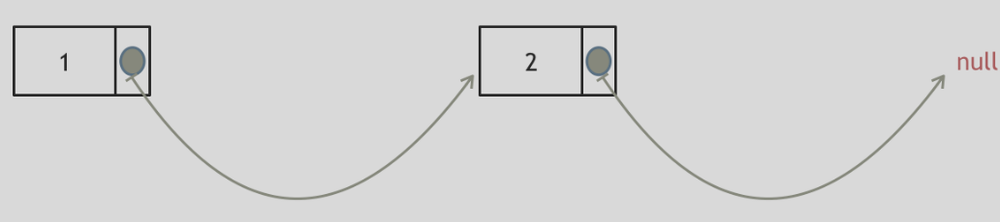

# 链表

## 1.链表基础理论

什么是链表，链表是一种通过指针串联在一起的线性结构，每一个节点由两部分组成，一个是数据域一个是指针域（存放指向下一个节点的指针），最后一个节点的指针域指向null（空指针的意思）。

链表的入口节点称为链表的头结点也就是head。

如图所示：


## 2.链表的类型

### 单链表

刚刚说的就是单链表。

### 双链表

单链表中的指针域只能指向节点的下一个节点。

双链表：每一个节点有两个指针域，一个指向下一个节点，一个指向上一个节点。

双链表 既可以向前查询也可以向后查询。

如图所示：


### 循环链表

循环链表，顾名思义，就是链表首尾相连。

循环链表可以用来解决约瑟夫环问题。


## 3.链表的存储方式

了解完链表的类型，再来说一说链表在内存中的存储方式。

数组是在内存中是**连续分布**的，但是链表在内存中可**不是连续分布**的。

链表是通过指针域的指针链接在内存中各个节点。

所以链表中的节点在内存中不是连续分布的 ，而是散乱分布在内存中的某地址上，分配机制取决于操作系统的内存管理。

如图所示：


这个链表起始节点为2， 终止节点为7， 各个节点分布在内存的不同地址空间上，通过指针串联在一起。

## 4.链表的定义

接下来说一说链表的定义。

链表节点的定义，很多同学在面试的时候都写不好。

这是因为平时在刷`leetcode`的时候，链表的节点都默认定义好了，直接用就行了，所以同学们都没有注意到链表的节点是如何定义的。

而在面试的时候，一旦要自己手写链表，就写的错漏百出。

这里我给出C/C++的定义链表节点方式，如下所示：

```c
#include <stdio.h> 
#include <stdlib.h>

typedef struct ListNode ListNode;

struct ListNode{
	int value;
	ListNode* next; 
};

ListNode* CreateListNode(int value) {
	ListNode* node = (ListNode*)malloc(sizeof(ListNode));
	node->value = value;
	node->next = NULL;
	return node;
}

int main() {
	ListNode* node1 = CreateListNode(1);
    ListNode* node2 = CreateListNode(2);
	ListNode* node3 = CreateListNode(3);
    ListNode* node4 = CreateListNode(4);
	
	node1->next = node2;
	node2->next = node3;
	node3->next = node4;
	
	int i;
	ListNode* temp = node1;
	for(i=0;i<3;i++){
		printf("%d->",temp->value);
		temp = temp->next;
	}
	printf("%d->NULL\n",node4->value); 
	
	temp = node1;
	while(temp) { 
		printf("%d->",temp->value);
		temp = temp->next;
	}
	printf("NULL\n");
	
	free(node1);
	free(node2);
	free(node3);
	free(node4);
	  
	return 0;
}
```

## 5.链表的操作

### 删除节点

删除D节点，如图所示：


只要将C节点的next指针 指向E节点就可以了。

那有同学说了，D节点不是依然存留在内存里么？只不过是没有在这个链表里而已。

是这样的，所以在C++里最好是再手动释放这个D节点，释放这块内存。

其他语言例如Java、Python，就有自己的内存回收机制，就不用自己手动释放了。

### 添加节点

如图所示：


可以看出链表的增添和删除都是O(1)操作，也不会影响到其他节点。

但是要注意，要是删除第五个节点，需要从头节点查找到第四个节点通过next指针进行删除操作，查找的时间复杂度是O(n)。

## 6.性能分析

再把链表的特性和数组的特性进行一个对比，如图所示：


数组在定义的时候，长度就是固定的，如果想改动数组的长度，就需要重新定义一个新的数组。

链表的长度可以是不固定的，并且可以动态增删， 适合数据量不固定，频繁增删，较少查询的场景。

## 7.删除元素

题意：删除链表中等于给定值 `val` 的所有节点。

示例 1： 输入：head = [1,2,6,3,4,5,6], `val` = 6 输出：[1,2,3,4,5]

示例 2： 输入：head = [], `val` = 1 输出：[]

示例 3： 输入：head = [7,7,7,7], `val` = 7 输出：[]

```c
```

这里以链表 1 4 2 4 来举例，移除元素4。


如果使用C，C++编程语言的话，不要忘了还要从内存中删除这两个移除的节点， 清理节点内存之后如图：



**当然如果使用java ，python的话就不用手动管理内存了。**

还要说明一下，就算使用C++来做`leetcode`，如果移除一个节点之后，没有手动在内存中删除这个节点，`leetcode`依然也是可以通过的，只不过，内存使用的空间大一些而已，但建议依然要养成手动清理内存的习惯。

这种情况下的移除操作，就是让节点next指针直接指向下下一个节点就可以了，

那么因为单链表的特殊性，只能指向下一个节点，刚刚删除的是链表的中第二个，和第四个节点，那么如果删除的是头结点又该怎么办呢？

这里就涉及如下链表操作的两种方式：

- **直接使用原来的链表来进行删除操作。**
- **设置一个虚拟头结点在进行删除操作。**

### 1.直接移除

```c
struct ListNode* removeElements(struct ListNode* head, int val) {
       //特殊情况，头节点为目标结点
	   while(head != NULL && head->value == val){
	   	     ListNode* temp = head;
			 head = head->next;
			 free(temp);
	   } 
	   //一般情况，中间结点为目标结点
	   ListNode* cur = head;
	   while(cur != NULL && cur->next != NULL){
	   	     if(cur->next->value == val){
	   	         ListNode* temp = cur->next;
				 cur->next = cur->next->next;
				 free(temp);		
			} else {
				 cur = cur->next;
			}
	   }
	   return head; 
}
```

直接使用原来的链表来进行移除。


移除头结点和移除其他节点的操作是不一样的，因为链表的其他节点都是通过前一个节点来移除当前节点，而头结点没有前一个节点。

所以头结点如何移除呢，其实只要将头结点向后移动一位就可以，这样就从链表中移除了一个头结点。


这样移除了一个头结点，是不是发现，在单链表中移除头结点 和 移除其他节点的操作方式是不一样，其实在写代码的时候也会发现，需要单独写一段逻辑来处理移除头结点的情况。

### 2.虚拟头节点移除

```c
//虚拟头节点删除结点 
struct ListNode* removeElements_2(struct ListNode* head, int val) {
       ListNode* dummyNode = CreateListNode(0);
       dummyNode->next = head;
       ListNode* cur = dummyNode;
       while(cur->next != NULL){
            if(cur->next->value == val){
            	ListNode* temp = cur->next;
            	cur->next = cur->next->next;
				free(temp); 
			}else{
				cur = cur->next;
			}   	
	   }
	   head = dummyNode->next;
	   return head;
}
```

以一种统一的逻辑来移除 链表的节点呢。

其实**可以设置一个虚拟头结点**，这样原链表的所有节点就都可以按照统一的方式进行移除了。

来看看如何设置一个虚拟头。依然还是在这个链表中，移除元素1。


这里来给链表添加一个虚拟头结点为新的头结点，此时要移除这个旧头结点元素1。

这样是不是就可以使用和移除链表其他节点的方式统一了呢？

来看一下，如何移除元素1 呢，还是熟悉的方式，然后从内存中删除元素1。

最后呢在题目中，return 头结点的时候，别忘了 `return dummyNode->next;`， 这才是新的头结点

- 时间复杂度: O(n)
- 空间复杂度: O(1)

**也可以通过递归的思路解决本题:**

基础情况：对于空链表，不需要移除元素。

递归情况：首先检查头节点的值是否为`val`，如果是则移除头节点，答案即为在头节点的后续节点上递归的结果；如果头节点的值不为 `val`，则答案为头节点与在头节点的后续节点上递归得到的新链表拼接的结果。

```c
struct ListNode* removeElementsRecursive(struct ListNode* head, int val) {
    if (head == NULL) return NULL;

    // 递归处理剩下的链表
    head->next = removeElementsRecursive(head->next, val);

    // 判断当前节点是否需要删除
    if (head->value == val) {
        struct ListNode* temp = head->next;
        free(head); // 释放当前节点
        return temp; // 返回下一个节点
    } else {
        return head; // 保留当前节点
    }
}

```

- 时间复杂度：O(n)
- 空间复杂度：O(n)