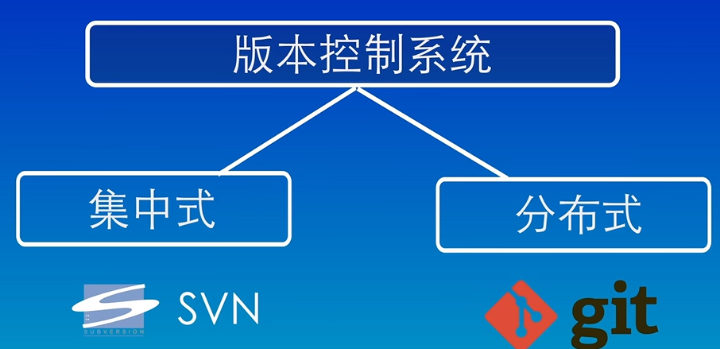

# `git`的使用

## 1.git的概念

`git`是一个免费开源的分布式版本控制系统,它使用一个特殊的叫做仓库的数据库,来记录文件的变化,仓库中的每个文件都有一个完整的版本,历史记录,可以看到谁在什么时间修改了哪些文件的,哪些内容,在需要的时候,也可以将文件恢复到之前的某一个版本。


目前世界上最流行的版本控制系统有两种



1.集中式版本控制系统,比如`svn 、cvs`等等

优点：所有的文件都保存在中央服务器上,每个人的电脑上只保存了一个副本,当你需要修改文件的时候,首先要从中央服务器上下载最新的版本,然后添加你想要的修改内容,修改完成之后再上传回中央服务器,集中式版本,控制系统的优点是使用起来非常简单,只需要从中央服务器上下载最新的版本,修改完成之后再上传到中央服务器上就可以了,不需要考虑其他的问题。


缺点：中央服务器的单点故障问题,如果中央服务器出现故障,或者网络连接出现问题,那么所有人都无法工作了,只能等待中央服务器或者网络恢复正常。


2.分布式版本控制系统,比如`git、 mercurial`等等

分布式版本控制系统就没有这个问题,每个人在电脑上都有一个完整的版本库,所以我们可以在本地进行修改,不需要考虑网络问题,这样即使中央服务器出现故障,我们也可以继续工作,当需要将我们的修改内容分享给其他人的时候,只需要将仓库互相同步一下就可以了。


## 2.git的常用命令

### 2.1 `git`的登录

1.检测版本

```sql
git -v
```

2.为了区分`linux`的命令，`git`的所以命令均以`git`开头

为了识别出是谁提交的内容，因此要配置一下用户名与邮箱

```sql
git config --global user.name "Magic Archer"
git config --global user.email 100028602+1pearl@users.noreply.github.com
```

> 

3.保存用户名与密码此后不必输入

```sql
git config --global credential.helper store
```

4.查看配置用户名与邮箱信息

```sql
git config --global --list
```

### 2.2 新建仓库

版本库又被称为仓库，又名`repository`,简称为`repo`,可以理解为一个目录，目录中所以的文件都可以被`git`管理起来，每个文件的创建、添加、删除系统均可由跟踪到，以便任何适合可以追踪历史或者还原到之前的某个版本。

创建一个目录，只需使用`git`将目录变为可以管理的仓库即可。

1.利用电脑本地直接创建一个仓库

```sql
git init
```

2.在远程服务器上克隆一个仓库

```sql
git clone url
```

演示操作

```sql
mkdir file1 #创建一个文件夹file1
cd file1    #进入到file1目录下
git init    #创建为一个可以被git管理的仓库
git init fileson1 #在file1下创建一个fileson1的目录并转为git可管理的仓库
ls -a       #一般ls可以查看文件下显示的目录，但隐藏目录要用ls -a
```

### 2.3 `git`的工作区域与文件的状态

`git`的工作区域分为3个，分为工作区、暂存器、本地仓库


工作区：文件夹（`Working Directory`）

暂存器：存放需要上传内容的临时暂存区域（又称为`index`）在`.git/index`中

本地仓库：即为云端代码托管仓库（`github、gitee、gitcode`）

三者的关系


对应产生的文件的4种状态

（1）未跟踪：已经创建还未被`git`管理的文件

（2）未修改：文件已经被`git`管理起来，但文件内容还未发生变化的文件

（3）已修改：已经修改的文件，但还未添加到暂存区的文件

（4）已暂存：已经修改，并添加到暂存器内的文件


### 2.4 添加与提交文件

#### 2.4.1 查看文件的状态

```sql
git status
```

#### 2.4.2 添加1个文件到仓库操作实例

```sql
echo "this is the first file">file1.txt #利用echo创建一个文件file1，并写入"this is ..."
vi file1.txt #进入vim修改file1.txt的内容
cat file1 #查看file1中文件内容
   git status #查看文件的状态1
git add file1 #添加文件到暂存区，如果要反向后退一步使用 git rm --cached file1
   git status #查看文件状态2
git commit -m "第一次提交" file1 #提交文件到本地仓库，-m+"注释"
   git status #查看文件状态3
   
```

文件状态1


文件状态2


文件状态3：可以看到`file1`没有了


#### 2.4.3 `git add`命令一次提交多个文件到暂存区

利用`echo “xxx”>file.x`命令创建多个文件，使用`ls`可以看到文件，`git status`看到文件处于工作区内。


然后使用`git add`命令一次性将文件放入暂存区

```sql
git add *.txt #将以txt结尾的文件添加到暂存区
git add .  #表示将该文件夹下的所以文件都添加到暂存区
```

#### 2.4.4 `git commit`提交文件到仓库

1.提交并写入提交版本注释

```sql
git commit -m "第一次提交"
```

2.进入到`vim`中写版本注释，然后提交

```sql
git commit #提交暂存器文件
#进入到Vim,并点击"i"，进入文版编辑模式
"第一次提交"
#使用Esc进入命令模式
:wq #保存退出Vim
```

3.查看提交记录

```sql
git log #查看提交记录
git log --oneline #查看提交信息简略
```

4.总结


### 2.5 `git reset`回退版本

1.三种类型

（1）回退到某版本，保留工作区与暂存区的内容

```sql
git reset --soft
```

（2）回退到某一版本，丢弃掉工作区与暂存区的修改内容，不建议使用

```sql
git reset --hard
```

（3）回退到某一版本，保留工作区的修改内容，丢弃暂存区的修改内容（默认`mixed`）

```sql
git reset --mixed
```

如下


```sql
git reset --soft HEAD^ #返回到上一个版本
git reset --soft 版本ID #回退到版本ID所在版本 
```

如果使用`git reset --hard`失误操作了，可以使用`git reflog`查看分支操作历史，然后使用`git reset --soft 版本ID`回溯即可。

### 2.6 `git diff`命令

#### 2.6.1 `git diff`默认在工作区与暂存区间比较差异

```sql
git diff
```


也可以在工作区、暂存区、本地仓库比较差异

版本之间比较差异

分支间比较差异


#### 2.6.2 比较版本库、暂存区与本地仓库

```sql
git diff #默认比较工作区与暂存区
git diff HEAD #比较工作区与本地库
git diff --cached #暂存区与本地库
```

#### 2.6.3 比较各个版本间的差异

```sql
git diff HEAD~ HEAD #比较现版本(HEAD)与上一版本(HEAD~)的差异
git diff HAED^ HEAD #比较现版本(HEAD)与上一版本(HEAD^)的差异
git diff HEAD^2 HEAD #比较现版本(HEAD)与上两个版本(HEAD~2)的差异
git diff HEAD~3 HEAD file3.txt #比较现版本(HEAD)与上三个版本(HEAD~3)的file3.txt的差异
```

总结


### 2.7 版本库中删除文件

删除文件的两种方法

（1）先删除工作区文件，再删除暂存区内容

```sql
rm file1 #直接在工作区删除file1
     git ls-files #查看暂存器的文件
git add . #删除(更新)在工作区已经被删除的文件file1.txt
git commit -m "删除了file1"
```

（2）直接全部删除

```sql
git rm file1
git commit -m "删除了file1"
```

（3）仅仅删除暂存区

```sql
git rm --cached 文件全称
```

总结


### 2.8 `gitignore`命令

#### 2.8.1 应该被忽略的文件


在工作区创建一个`.gitignore`的配置文件，并在`.gitignore`中写入`.xxx`的提交要忽略的文件即可

```sql
echo "access">access.log #创建一个access.log文件
echo access.log>.gitignore #将access.log文件名写入到.gitignore文件中
```

或者

```sql
echo .gitignore
vi .gitignore #进入到.gitignore文件中,点击"i"
#输入要屏蔽上传的文件
*.log
*.o
*.exe
temp/ #文件夹名/,忽略该文件夹
等
#按Esc并
:wq #保存并退出
```

另外，如果一个空文件夹不会被纳入到版本控制在

#### 2.8.2 正则符号总结


各个语言可以忽略文件汇总：[github/gitignore: A collection of useful .gitignore templates](https://github.com/github/gitignore)

### 2.9 `SSH`配置与克隆仓库

[链接](git@github.com:1pearl/Storage_for_Ivan.git)

### 2.10 关联远程仓库

1.先创建一个远程仓库


2.复制仓库链接


```sql
git init #初始化仓库
#网页下根据提示复制粘贴即可
git remote add origin git@github.com:1pearl/Notes.git #关联本地与远程仓库，origin为别名

git remote -v #查看当前仓库所对应的远程仓库的别名与地址

git branch -M main #指定分支的名称为main

git push -u origin main #将本地的main分支与远程仓库的main分支关联起来，注意在这之前要有文件在“本地仓库”
```

3.拉取，获取远程仓库的修改内容

```sql
git pull origin main #git pull <远程仓库别名> <远程仓库分支名>:<本地分支名>，如果远程分支名与本地分支名相同可省略其一。
```

其中`git pull`命令会默认将远程的内容与本地的内容进行一次合并，如果出现冲突就无法成功。


但`git fetch`不会合并仓库内容，只是将修改的内容拉取到本地仓库，不会执行合并操作，因此不会发生冲突。

4.总结


### 2.11 分支

#### 2.11.1 创建新的分支

```sql
git branch 分支名 
```

#### 2.11.2 查看当前所处分支

```sql
git branch
```

#### 2.11.3 切换到不同分支

```sql
git checkout 分支名 #可能出现歧义
git switch 分支名 #建议使用，不会出现歧义
```

#### 2.11.4 合并分支

切换到要合并的分支(主分支)，将次分支合并至主分支

```sql
git merge 要合并的分支(次分支) #前提切换到了要合并的分支，将“要合并的分支”合并到与合并的分支中
```


#### 2.11.5 删除分支

```sql
git branch -d 分支名 #已经合并过的分支
git branch -D 分支名 #未合并，强制删除该分支，将丢失该分支的所以内容
```

总结


### 2.12 合并冲突

如果两个人同时改动了同一个文件的同一行代码，合并时就会产生冲突

首先使用`git status`查看冲突的文件或是使用`git diff`来查看冲突的列表，然后单独编辑冲突文件

```sql
vi 冲突文件 #编辑“冲突文件”
```

然后提交，那么就会自动合并分支

### 2.13 回退与`rebase`

`rebase`即可以将文件分支的内容直接嫁接到原分支


回退到某个分支

```sql
git checkout -b 分支名 分支编号 #如：git checkout -b dev 244d35
```

### 2.14 git工作流管理

1.`github flow`模型


### 2.15 基本使用流程

```sql
git init #初始化仓库
git add .
git commit -m "注释" #预提交
git git remote add origin git@github.com:1pearl/Notes.git #关联远程与本地仓库
git branch -M main #命名分支
git push -u origin main #提交到远程仓库
```

关联后,再次提交

```sql
git add .
git commit -m "注释"
git push -u origin main #提交到远程仓库
```

